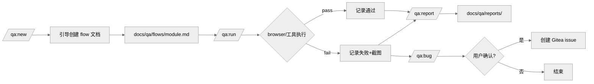

# REQ-002: qa 插件 - 浏览器 UAT/E2E 测试工作流

## 元信息

| 属性 | 值 |
|-----|-----|
| 编号 | REQ-002 |
| 类型 | 全栈 |
| 状态 | 开发中 |
| 模块 | qa |
| 优先级 | P2 |
| 创建日期 | 2026-05-11 |
| 负责人 | - |
| branch | feat/REQ-002-qa-uat-e2e-workflow |
| issue | - |

## 生命周期

- [x] 草稿（编写中）
- [x] 待评审
- [x] 评审通过
- [x] 开发中
- [ ] 测试中
- [ ] 已完成

---

## 一、需求描述

### 1.1 背景

devflow 现有 `browser:browser` 技能提供了底层浏览器操控能力，但缺乏规划层和流程规范：没有结构化的测试场景文档，每次验收都依赖临时口述，结果无法沉淀。

团队需要一个以"测试流程文档"为核心的 QA 工作流——文档人工维护、AI 按文档执行、结果可追溯、问题可直接上报 bug。

### 1.2 目标

- **功能目标**：提供 `qa` 插件，包含测试文档引导创建、AI 执行测试、报告生成、bug 上报完整闭环
- **效果目标**：测试流程文档越迭代越完善，UAT 验收效率提升，减少口口相传的测试用例遗漏

### 1.3 客户场景

- **场景1**：前端功能上线前，开发者希望快速验收主流程，无需手写 Playwright 脚本，直接告诉 Claude 要测什么，AI 自动操控浏览器并报告结果
- **场景2**：QA 维护一份登录/下单等核心流程文档，每次迭代后执行 `/qa:run` 做回归验收，失败项自动提到 Gitea issue
- **场景3**：新成员加入，通过阅读 `docs/qa/flows/` 快速了解系统核心操作路径

### 1.4 价值

- 测试知识文档化：测试场景沉淀为可版本管理的 Markdown 文档
- 降低自动化门槛：不需要写代码，AI 作为指挥家协调工具完成执行
- 闭环：测试 → 报告 → bug 上报，无需人工搬运

### 1.5 范围与边界

- **本期包含**：
  - `qa` 插件骨架（commands/ + skills/）
  - 测试流程文档格式规范及 `/qa:new` 引导创建
  - `/qa:run` 执行测试（Claude 作为指挥家，调用 browser 技能等底层工具）
  - `/qa:report` 生成 Markdown 测试报告
  - `/qa:bug` 询问用户是否上报，按项目配置创建 Gitea issue
- **本期不做**：
  - 测试结果的历史趋势统计
  - 与 CI/CD 流水线集成
  - desktop app、API 等非浏览器执行引擎的专用适配（预留扩展接口，工具层自行实现）
  - 截图自动附件上传到 Gitea（文字描述 + 场景链接即可）

### 1.6 干系人

| 角色 | 关注点 | 备注 |
|------|-------|------|
| 开发者 | 上线前快速 UAT 验收 | 主要使用者 |
| QA | 回归测试、bug 上报 | 维护测试文档 |
| 新成员 | 了解系统操作路径 | 只读 flows 文档 |

---

## 二、功能清单

- [x] **qa 插件骨架**：创建 `plugins/qa/` 目录结构（commands/ skills/）并注册到 marketplace.json
- [x] **`/qa` 入口命令**：列出 `docs/qa/flows/` 下所有模块及上次执行状态
- [x] **`/qa:new` 引导创建**：多轮对话收集测试场景，生成结构化 flow 文档
- [x] **`/qa:run [module]`**：读取 flow 文档，逐场景调用 browser 等工具执行，记录 pass/fail
- [x] **`/qa:report`**：从最近一次运行结果生成 `docs/qa/reports/YYYY-MM-DD-<module>.md`
- [x] **`/qa:bug`**：展示失败场景，询问用户是否上报，按项目 giteaToken 等配置创建 issue
- [x] **`qa-executor` skill**：指导 Claude 作为指挥家按场景执行测试、记录结果的核心逻辑

---

## 三、业务规则

| 类型 | 规则 | 说明 |
|------|-----|------|
| 运行环境 | 必须在 Codex Chrome 或 Claude 桌面客户端中使用 | 普通终端无浏览器工具，需提示用户 |
| 平台无关 | Claude 只负责"指挥"，不直接实现浏览器操作 | 底层工具（browser skill 等）负责执行，插件不内置操作细节 |
| 文档格式 | flow 文档必须包含元信息（操作方式、入口 URL）和场景列表 | 格式见第四章 |
| bug 上报 | 必须询问用户确认后才创建 issue，不自动上报 | 按 giteaToken 配置决定能力 |
| 结果存储 | 报告写入 `docs/qa/reports/`，纳入 git | 不自动 push |
| 非功能约束 | flow 文档单文件建议 < 30 场景 | 过多时建议按功能域拆分 |

---

## 四、使用场景

### 场景1：首次为某功能创建测试文档

- **角色**：开发者 / QA
- **前置条件**：已进入 Codex Chrome 或 Claude 桌面端
- **基本流程**：
  1. 执行 `/qa:new` → AI 询问功能名称、入口 URL、操作方式
  2. AI 多轮对话收集测试场景（步骤 + 预期结果）
  3. 用户确认后生成 `docs/qa/flows/<module>.md`
- **异常流程**：
  - 用户描述场景不清晰 → AI 追问直到明确

### 场景2：执行回归测试

- **角色**：开发者 / QA
- **前置条件**：`docs/qa/flows/` 下有已创建的 flow 文档
- **基本流程**：
  1. 执行 `/qa:run` 或 `/qa:run <module>`
  2. AI 读取 flow 文档，逐场景调用 browser 技能执行
  3. 每步记录 pass/fail，执行完毕输出汇总
  4. 执行 `/qa:report` 生成报告文件
- **异常流程**：
  - 某场景执行失败 → 记录失败原因和截图路径，继续下一场景

### 场景3：上报失败 bug

- **角色**：QA
- **前置条件**：最近一次 `/qa:run` 有失败场景
- **基本流程**：
  1. 执行 `/qa:bug`
  2. AI 列出所有失败场景，询问"是否上报到 Gitea？"
  3. 用户确认后，按项目 giteaToken 配置逐条创建 issue
- **异常流程**：
  - 未配置 giteaToken → 提示用户配置后重试，或手动复制内容

---

## 五、数据与交互

### 后端/全栈：接口需求

| 能力 | 输入 | 输出 | 说明 |
|------|------|------|------|
| 创建 flow 文档 | 模块名、场景列表 | Markdown 文件 | 写入 `docs/qa/flows/` |
| 执行测试场景 | flow 文档路径 | pass/fail 列表 + 截图路径 | 调用 browser 技能 |
| 生成报告 | 最近执行结果 | Markdown 报告文件 | 写入 `docs/qa/reports/` |
| 创建 Gitea issue | 失败场景描述、项目配置 | issue URL | 依赖 giteaToken 配置 |

---

## 六、测试要点

### 6.1 技术测试

- [ ] `/qa:new` 引导流程能正确生成符合格式的 flow 文档
- [ ] `/qa:run` 能逐场景执行并正确记录 pass/fail
- [ ] `/qa:report` 生成报告包含全部场景及结果
- [ ] `/qa:bug` 在无 giteaToken 时给出明确提示而非报错
- [ ] 在非 Codex Chrome / Claude 桌面端运行时，给出环境不满足的提示

### 6.2 验收标准

- [ ] 执行 `/qa:new` 后，`docs/qa/flows/` 下能看到新建的测试文档，格式符合规范
- [ ] 执行 `/qa:run` 后，能在终端看到逐场景的 pass/fail 汇总
- [ ] 执行 `/qa:report` 后，`docs/qa/reports/` 下生成带日期的报告文件
- [ ] 执行 `/qa:bug` 后，Gitea 上能看到对应的 issue（需配置 giteaToken）

---

## 七、图示（可选）

### 7.1 流程图



---

## 八、评审记录

| 日期 | 评审人 | 结论 | 意见 |
|-----|-------|------|------|
| 2026-05-12 | haiqing | ✅ 通过 | - |

---

## 九、变更记录

| 日期 | 变更内容 | 影响范围 |
|-----|---------|---------|
| 2026-05-11 | 初始版本 | - |

---

## 十、关联信息

- **关联需求**：-
- **相关文档**：`docs/design/`（待补充）
- **假设**：用户在 Codex Chrome 或 Claude 桌面客户端中运行，browser 技能可用
- **外部依赖**：`browser:browser` 技能（底层浏览器操控）；giteaToken（可选，bug 上报）
- **风险项**：browser 技能能力边界不确定，复杂交互场景可能需要多次重试；flow 文档格式若不规范，执行层难以解析

---

## 十一、实现方案

> 本章节在 `/req:dev` 阶段由 AI 分析代码后自动生成，创建需求时无需填写。

### 11.1 数据模型

无数据库。核心存储文件：

| 文件 | 说明 |
|------|------|
| `docs/qa/flows/<module>.md` | 测试流程文档，人工维护 |
| `docs/qa/reports/YYYY-MM-DD-<module>.md` | 测试报告，`/qa:run` 自动生成 |

**flow 文档格式规范**（由模板约束）：
- 元信息区：模块名、操作方式（browser/api/desktop）、入口 URL、创建日期、最后执行日期
- 场景区：每个场景含 ID（S01/S02...）、前置条件、步骤列表、预期结果断言列表

### 11.2 API 设计

本插件为 CLI 工具，无 HTTP API。命令即接口：

| 命令 | 参数 | 输出 |
|------|------|------|
| `/qa` | - | 列出 flows/ 下所有模块 + 上次执行状态 |
| `/qa:new [module]` | 模块名（可选） | 生成 `docs/qa/flows/<module>.md` |
| `/qa:run [module]` | 模块名（省略则全部） | 逐场景 pass/fail 汇总 + 写报告文件 |
| `/qa:report` | - | 格式化最近报告并展示 |
| `/qa:bug` | - | 读最近报告失败项 → 询问 → 创建 Gitea issue |

### 11.3 文件改动清单

**新增文件**：

```
plugins/qa/
├── commands/
│   ├── qa.md                  # 入口：列出模块 + 状态
│   ├── qa:new.md              # 引导创建测试流程文档
│   ├── qa:run.md              # 执行测试场景
│   ├── qa:report.md           # 生成/展示测试报告
│   └── qa:bug.md              # 失败项上报 Gitea issue
├── skills/
│   └── qa-executor/
│       └── SKILL.md           # 核心执行引导 skill
└── templates/
    └── flow-template.md       # flow 文档模板
```

**修改文件**：

```
.claude-plugin/marketplace.json   # 追加 qa 插件注册
```

### 11.4 实现步骤

1. **创建目录结构**：`plugins/qa/commands/`、`plugins/qa/skills/qa-executor/`、`plugins/qa/templates/`
2. **注册插件**：在 `.claude-plugin/marketplace.json` 追加 qa 插件条目
3. **实现 flow 模板**：`plugins/qa/templates/flow-template.md`（规范场景格式）
4. **实现 qa-executor skill**：`plugins/qa/skills/qa-executor/SKILL.md`（指导 Claude 读 flow 文档、按操作方式选工具、记录结果）
5. **实现 `/qa` 入口**：`plugins/qa/commands/qa.md`（扫描 flows/ 展示模块列表）
6. **实现 `/qa:new`**：`plugins/qa/commands/qa:new.md`（多轮对话 → 按模板生成 flow 文档）
7. **实现 `/qa:run`**：`plugins/qa/commands/qa:run.md`（调用 qa-executor，写报告文件）
8. **实现 `/qa:report`**：`plugins/qa/commands/qa:report.md`（读最新报告文件展示）
9. **实现 `/qa:bug`**：`plugins/qa/commands/qa:bug.md`（读失败项 → 询问 → 创建 issue）
