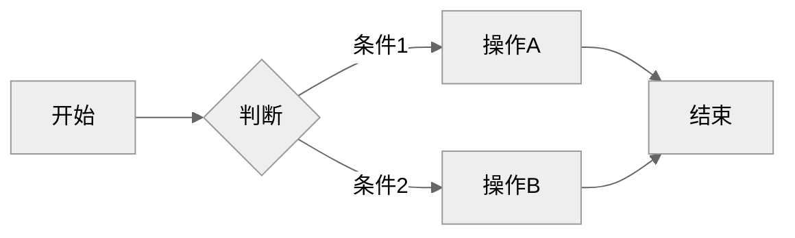
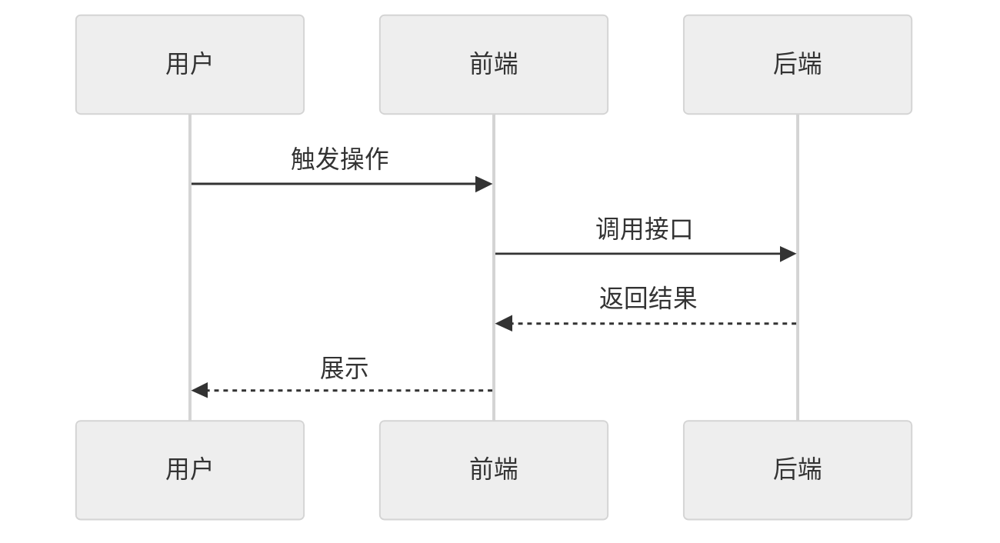
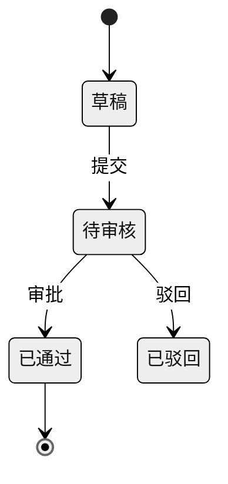

# REQ-004: req 插件更名为 rd

## 元信息

| 属性 | 值 |
|-----|-----|
| 编号 | REQ-004 |
| 类型 | 全栈 |
| 状态 | 开发中 |
| 模块 | 插件架构 |
| 优先级 | P2 |
| 创建日期 | 2026-09-15 |
| 负责人 | - |
| branch | feat/REQ-004-rename-req-plugin-to-rd |
| issue | - |

## 生命周期

<!-- 需求状态流转：草稿 → 待评审 → 评审通过 → 开发中 → 测试中 → 已完成 -->

- [x] 草稿（编写中）
- [x] 待评审
- [x] 评审通过
- [x] 开发中
- [ ] 测试中
- [ ] 已完成

---

## 一、需求描述

### 1.1 背景

req 插件从「需求管理」起步，已扩展为完整的研发工作流。按命令 Audience 标注与职责统计，34 条命令中约 29 条是研发侧或通用能力（dev / do / fix / test* / commit / pr / review-pr / branch / issue / release / changelog 等），只有 5 条是产品侧（new / prd / prd-edit / review / split）。插件名 `req`（requirement，需求）只覆盖其中一部分。

Claude Code 插件命令必须带 `/<插件名>:` 前缀，`plugin.json` 没有别名或短前缀字段（2026-09 核实），插件名是用户认识插件能力的第一入口，名称与能力不符只能通过更名解决。

### 1.2 目标

- **功能目标**：插件更名为 `rd`（R&D，研发），命令前缀 `/req:` → `/rd:`，与 `pm`（项目管理）形成分工；为已安装用户提供过渡插件与迁移路径，并协助清理下游项目中残留的 `/req:` 引用。
- **效果目标**：老用户迁移不超过 3 步（卸载 req、安装 rd、执行 `/rd:migrate`）；`.devflow/` 配置零迁移；仓库内除历史 changelog 与已完成需求外 `/req:` 残留为 0，由 `check-layout.py` 守卫与 CI 持续保证。

### 1.3 客户场景

> 记录客户提出的原始业务场景和诉求

- **场景1**：维护者讨论插件优化时指出「每次都是 /req****」，质疑命令名是否合理——命令名与多数能力不符。
- **场景2**：新用户在插件市场看到 `req`，以为它只管需求文档，错过 commit / pr / review-pr / release 等研发流程能力。
- **场景3**：已安装 req 的团队升级后需要明确的更名提示与迁移步骤，而不是命令突然全部失效。

### 1.4 价值

名称即文档，降低新用户理解成本；`pm`（项目管理）与 `rd`（研发）角色分工清晰；借一次大版本集中完成破坏性变更，且只换前缀、不动配置，避免用户在 v3 迁移后再做一次配置迁移。

### 1.5 范围与边界

> 明确本期做什么、不做什么，防止范围蔓延

- **本期包含**：插件目录、`plugin.json`、`marketplace.json` 更名；命令、shared、helper skill、agent 命名空间、hook 脚本输出、templates、README / tutorial 三语、CLAUDE.md 中的 `/req:` 全部改为 `/rd:`；过渡插件 `req`（仅 `/req:help` 更名提示）；`/rd:migrate` 新增下游项目 `/req:` 引用扫描与逐项替换；`check-layout.py` 新增 `/req:` 过时引用规则；以 v4.0.0 单独发版。
- **本期不做**：34 条命令改名；`REQ-XXX` 编号、`docs/requirements/` 目录、`requirementProject` / `requirementRole` / `requirementsDir` 配置字段、`.claude/.req-auto` / `.claude/.req-confirm-commit` marker 改名；把产品侧命令拆到 pm；改写历史 changelog 与已完成需求文档；Claude Code 前缀或别名机制（平台不支持）。

### 1.6 干系人

> 除了提出方，还有哪些人会因此变化受影响

| 角色 | 关注点 | 备注 |
|------|-------|------|
| 提出方（维护者） | 名称与能力一致、迁移成本可控 | 需同步更新 CLAUDE.md 与记忆中的 `/req:` 约定 |
| 已安装 req 的下游用户 | 升级后命令不突然失效、迁移步骤清楚 | 需重装一次插件，可选执行 `/rd:migrate` |
| 新用户 | 从名称理解插件能力 | 直接安装 `rd@devflow` |
| pm 插件 | 读取需求数据的约定不变 | 复用 `requirement*` 字段，无需改动 |
| 英文 / 韩文读者 | `rd` 缩写含义 | 文档首次出现时注明 R&D |

---

## 二、功能清单

> 列出所有功能点，开发完成后勾选

- [x] **插件更名**：`plugins/req` → `plugins/rd`，`plugin.json` 的 `name` 与 `marketplace.json` 条目改为 `rd`
- [x] **命令前缀替换**：命令、shared、helper skill、hook 脚本输出中的 `/req:` 全部改为 `/rd:`
- [x] **agent 命名空间**：5 个 agent 的委派写法 `req:xxx` → `rd:xxx`
- [x] **模板同步**：`templates/` 下会复制到下游项目的约 36 处 `/req` 引用改为 `/rd`
- [x] **过渡插件 req**：marketplace 保留 `req` 条目，仅含 `/req:help`，输出更名说明与迁移步骤
- [x] **下游引用清理**：`/rd:migrate` 扫描当前项目 `docs/prompt/`、`docs/requirements/templates/`、CLAUDE.md 中的 `/req:` 引用，逐项确认后替换
- [x] **过时引用守卫**：`check-layout.py` 将 `/req:` 视为过时引用，历史文档豁免
- [x] **文档同步**：README / tutorial 三语、根与插件目录级 CLAUDE.md，首次出现 `rd` 注明 R&D
- [ ] **发版 v4.0.0**：changelog 写明破坏性变更与迁移三步

---

## 三、业务规则

| 类型 | 规则 | 说明 |
|------|-----|------|
| 命名 | 只换插件前缀，34 条命令名保持不变 | 迁移说明可归结为一句「把 `/req:` 换成 `/rd:`」 |
| 命名 | 入口命令保留 `req`，调用为 `/rd:req` | 语义即「研发查看需求列表」 |
| 兼容 | `REQ-XXX` 编号、`docs/requirements/`、`requirement*` 配置字段不改 | 这些指「需求」概念而非插件名；老用户 `.devflow/` 零迁移 |
| 兼容 | `.claude/.req-auto`、`.claude/.req-confirm-commit` 不改名 | 用户本地文件，改名会让已开启的提交确认静默失效 |
| 迁移 | `/rd:migrate` 替换下游引用必须逐项确认 | 下游文件可能已被用户改写，禁止静默批量替换；拒绝项保留原文并在汇总中列出 |
| 迁移 | 过渡插件 `req` 保留一个大版本，v5 删除 | 只注册 `/req:help`，与 `rd` 并存不产生重复命令 |
| 非功能约束 | 以 v4.0.0 单独发版 | 破坏性变更：旧 `req@devflow` 安装与 `enabledPlugins` 条目失效 |
| 非功能约束 | 仓库内除 `docs/changelogs/`、`docs/requirements/completed/` 外无 `/req:` 残留 | 由 `check-layout.py --check` 与 CI 保证 |
| 非功能约束 | 英文 / 韩文文档与插件描述首次出现 `rd` 时注明 R&D | 国际读者可读 |

---

## 四、使用场景

### 场景1：新用户安装

- **角色**：新用户
- **前置条件**：已添加 devflow marketplace
- **基本流程**：
  1. 执行 `claude plugins install rd@devflow` → 安装 rd 插件
  2. 输入 `/rd` → 斜杠菜单列出全部 rd 命令
  3. 执行 `/rd:init <项目名>` → 初始化行为与 v3 一致
- **异常流程**：
  - 误装 `req@devflow` → 只有 `/req:help`，提示改装 `rd@devflow`

### 场景2：老用户升级

- **角色**：已安装 req 的团队成员
- **前置条件**：项目已按 v3 使用 `.devflow/` 配置
- **基本流程**：
  1. 更新 marketplace → `req` 变为过渡插件，原 `/req:*` 命令不再可用
  2. 执行 `/req:help` → 显示更名说明与迁移三步
  3. 卸载 `req@devflow`、安装 `rd@devflow` → `/rd:*` 可用，`.devflow/` 配置与本地 marker 直接生效
  4. 执行 `/rd:migrate` → 列出项目内 `/req:` 引用 → 逐项确认替换 → 输出替换汇总
- **异常流程**：
  - 未卸载 req 同时安装 rd → 两者并存，req 只剩 help，不冲突
  - 项目内无 `/req:` 引用 → 提示无需清理
  - 用户拒绝某处替换 → 保留原文，汇总中列出未替换项

### 场景3：维护者执行更名

- **角色**：维护者
- **前置条件**：v3.0.0 已发布，工作区干净
- **基本流程**：
  1. `check-layout.py` 新增 `/req:` 规则 → 列出全部残留位置
  2. 按清单替换并 `git mv plugins/req plugins/rd` → 守卫与冒烟测试通过
  3. `/rd:release` 发布 v4.0.0 → changelog 含破坏性变更与迁移步骤
- **异常流程**：
  - 守卫漏报（跨行、变量拼接等写法）→ 发版前全文 grep `/req` 复核

---

## 五、数据与交互

> 根据需求类型填写不同内容：
> - **后端 / 全栈**：描述需要的接口能力和业务语义，技术方案在 `/req:dev` 阶段生成
> - **前端**：描述页面交互逻辑，`/req:dev` 阶段自动匹配后端接口

### 后端/全栈：接口需求

| 能力 | 输入 | 输出 | 说明 |
|------|------|------|------|
| 插件安装 | `rd@devflow` | rd 命令全集 | 能力与 v3 req 一致，仅前缀不同 |
| 更名提示 | `/req:help`（过渡插件） | 更名说明、迁移三步 | 过渡插件唯一命令 |
| 下游引用清理 | 当前项目目录 | `/req:` 引用清单 → 逐项替换结果汇总 | `/rd:migrate` 新增能力 |
| 过时引用检查 | 仓库插件目录 | `/req:` 残留位置列表，退出码 | `check-layout.py --check`，CI 执行 |

### 前端：交互逻辑

> 按页面/模块描述用户操作和数据流转，不指定具体接口

不涉及：DevFlow 为 CLI 插件，无页面交互。

---

## 六、测试要点

### 6.1 技术测试

- [x] 测试点1：`check-layout.py --check` 通过；人为植入一处 `/req:` 残留时能被报出
- [x] 测试点2：diag 冒烟测试与 GitHub Actions CI 通过
- [ ] 测试点3：安装 rd 后 `claude plugin details rd` 列出全部命令与 helper skill，无重复项
- [ ] 测试点4：5 个 agent 以 `rd:xxx` 名称可被委派（dev / fix / review-pr 各跑一次委派路径）
- [x] 测试点5：SessionStart、validate-requirement、confirm-before-commit 三个 hook 的输出中无 `/req:`
- [ ] 测试点6：在含 `/req:` 引用的样例项目执行 `/rd:migrate`，逐项确认替换；拒绝项保留原文
- [x] 测试点7：过渡插件 req 只注册 `/req:help` 一条命令

### 6.2 验收标准

> 产品/业务方验收时的确认项，描述可观测的业务结果

- [ ] 验收项1：新环境执行 `claude plugins install rd@devflow`，输入 `/rd` 能看到全部命令，`/rd:init` 初始化成功
- [ ] 验收项2：已装 req 的环境更新 marketplace 后，`/req:help` 显示更名说明；按提示重装 rd 后，原项目 `.devflow/` 配置不做任何修改即可用 `/rd:status` 正常读取需求
- [ ] 验收项3：开启过提交确认（存在 `.claude/.req-confirm-commit`）的项目，重装后 `git commit` 仍弹出确认
- [ ] 验收项4：README / tutorial 三语中命令均为 `/rd:`，首次出现 rd 处注明 R&D

---

## 七、图示（可选）

> 用 Mermaid 绘制，GitHub/Gitea 原生渲染。主题建议统一用 `neutral`（打印友好、明暗模式兼容）。
> 无图可删除本节，按需保留下方子节。

### 7.1 流程图（业务流程、用户操作路径）

### 7.2 时序图（接口调用链、前后端交互）

### 7.3 ER 图 / 状态图（按需）

---

## 八、评审记录

| 日期 | 评审人 | 结论 | 意见 |
|-----|-------|------|------|
| 2026-09-15 | haiqing | 通过 | - |

---

## 九、变更记录

| 日期 | 变更内容 | 影响范围 |
|-----|---------|---------|
| 2026-09-15 | 初始版本 | - |

---

## 十、关联信息

- **关联需求**：REQ-003（命令-技能单源派生机制，同属插件架构模块）；QUICK-002（消除斜杠菜单重复项，确立 command 单一入口）
- **相关文档**：`docs/changelogs/v3.0.0.md`（上一次破坏性变更与迁移说明）；`plugins/req/shared/_storage.md`（配置约定，本需求不改）；`scripts/check-layout.py`（过时引用守卫）
- **假设**：Claude Code 插件命名空间继续由 `plugin.json` 的 `name` 决定、无别名机制（2026-09 核实）；斜杠菜单按命令名模糊匹配，更名不增加输入成本
- **外部依赖**：无（marketplace 由本仓库自管）
- **风险项**：下游项目若不执行 `/rd:migrate`，其 `docs/prompt/` 等处的 `/req:` 引用会长期残留（缓解：`/req:help` 与 v4 changelog 写明迁移步骤）；约 1344 行替换存在遗漏风险（缓解：守卫 + 发版前全文 grep）；`${CLAUDE_PLUGIN_ROOT}` 在命令正文中的替换尚未实测（v3.0.0 发布后先验证，影响模板读取类命令）

---

## 十一、实现方案

> 本章节在 `/req:dev` 阶段由 AI 分析代码后自动生成，创建需求时无需填写。

### 11.1 数据模型

> DevFlow 为 CLI 插件，无数据库；此处为 manifest 与配置层面的变更。

| 对象 | 变更 |
|------|------|
| `.claude-plugin/marketplace.json` | 原 `req` 条目改为 `rd`（source `./plugins/rd/`，描述注明 R&D 研发）；新增 `req` 过渡插件条目（source `./plugins/req/`） |
| `plugins/rd/.claude-plugin/plugin.json` | `name: rd`，版本 **5.0.0**（接续 req 4.5.2，更名为破坏性变更） |
| `plugins/req/.claude-plugin/plugin.json`（新建） | 过渡插件，版本 **5.0.0**（须大于 4.5.2，老用户 `/plugin` 更新才能拉到） |
| 不变 | `.devflow/` 配置字段、`.claude/.req-*` marker、`REQ-XXX` 编号、`docs/requirements/` |

实测盘点（2026-09-15，排除 changelog / 已完成需求 / 本文档）：`/req[:xxx]` 1190 行 / 92 文件（其中单独 `/req` 44 处）；`req@devflow` 12 行；`plugins/req/` 路径 25 行；单词形式 `req` 70 行；agent 在命令中以裸名引用（如 `code-scout`），无 `req:` 命名空间写法。

### 11.2 API 设计

> 基于第五章接口需求，结合项目代码和 CLAUDE.md API 风格，生成具体技术方案

- **`/rd:*`**：34 条命令名不变；入口命令为 `/rd:req`
- **`/req:help`**（过渡插件唯一命令）：输出更名说明与迁移三步（卸载 `req@devflow` → 安装 `rd@devflow` → `/rd:migrate`）；`model: claude-haiku-4-5-20251001`，无需工具
- **`/rd:migrate` 新增「2C 命令前缀迁移」**（无参数时与 2A 一并自动检测）：
  - 扫描下游项目 `CLAUDE.md`、`docs/prompt/**`、`docs/requirements/templates/*`、`.claude/skills/**`；不扫需求文档与 changelog
  - 替换映射：`/req:<cmd>` → `/rd:<cmd>`；单独 `/req` → `/rd:req`
  - 逐处展示后确认：`y` 替换 / `n` 跳过 / `a` 本文件剩余全部替换 / `q` 结束；最后汇总已替换与跳过项
- **`scripts/check-layout.py`**：新增 `/req` 过时引用规则，扫描范围扩到 README / tutorial 三语、CLAUDE.md、`docs/design`、`docs/prompt`、需求索引与模块文档；豁免过渡插件目录 `plugins/req/`，以及同行或前 3 行出现「更名」等字样的说明文字；`PLUGINS` 列表改为 rd / req / api / pm / diag

### 11.3 文件改动清单

| 组 | 做法 | 范围 |
|----|------|------|
| A 目录与清单 | `git mv plugins/req plugins/rd`；改两处 JSON；新建过渡插件 `plugin.json` + `commands/help.md` | 4 文件 + 目录 |
| B 机械替换 | sed：`/req:xxx`→`/rd:xxx`、单独 `/req`→`/rd:req`、`req@devflow`→`rd@devflow`、`plugins/req/`→`plugins/rd/` | `plugins/rd/**`、pm、api、README / tutorial 三语、CLAUDE.md、`docs/design`、`docs/prompt`、需求索引与模块文档、`check-layout.py`；排除 changelog、已完成需求、本文档 |
| C 人工处理 | 单词形式 `req` 逐处判断（`swagger-parser.py` 的 Python 变量 `req` 不动） | `check-layout.py`、`version-bumper`（版本表加 rd 与过渡插件）、CLAUDE.md（插件全景、「req 插件核心机制」、更名说明）、pm `risk.md` / `_common.md`、README 三语插件表与章节标题（注明 R&D）、`plugins/rd/CLAUDE.md`、`update.md` 等 |
| D 新增 | `migrate.md` 增 2C 节，同步 description 与命令格式 | 1 文件 |
| E 需求文档 | 回写本章、勾选功能清单 | 本文档 |

### 11.4 实现步骤

1. **守卫先行**：`check-layout.py` 加 `/req` 规则并扩展扫描范围，跑一次记录基线命中数
2. **目录与清单**：`git mv plugins/req plugins/rd`，改 `marketplace.json` 与 rd `plugin.json`
3. **机械替换**：按 B 组范围与排除一次性 sed，跑守卫看剩余命中
4. **人工处理 C 组**：主会话自己改（跨文件语义判断，不满足委派准入）
5. **新建过渡插件 req**，守卫对其豁免
6. **`migrate.md` 增 2C**
7. **验证**：守卫 `--check` 与 diag 冒烟测试；JSON 校验；全仓 grep `/req` 仅剩 changelog / 已完成需求 / 本文档 / 过渡插件 / 2C 说明；`git diff --stat` 分区复核并抽查 hook 输出（diff 上千行不整篇进上下文，靠 grep 断言 + 抽查）
8. **收尾**：勾选功能清单，提交并建 PR；「从 marketplace 安装 rd」「老用户看到 `/req:help`」两条验收须合并并 `/plugin` 更新后实测
