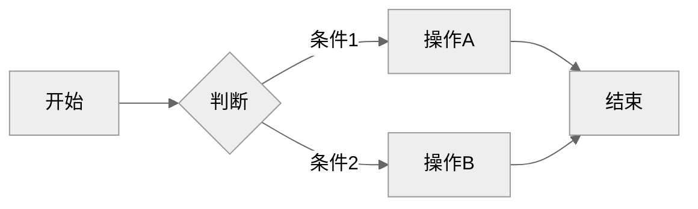
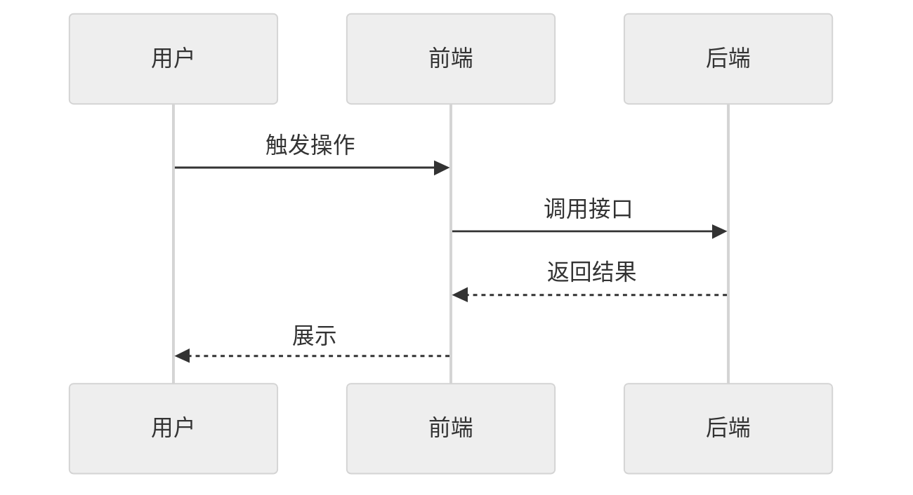
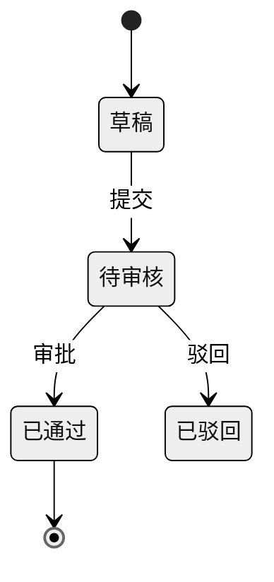

# REQ-005: PR 命令合并为 /rd:pr 子命令

## 元信息

| 属性 | 值 |
|-----|-----|
| 编号 | REQ-005 |
| 类型 | 全栈 |
| 状态 | 开发中 |
| 模块 | 插件架构 |
| 优先级 | P2 |
| 创建日期 | 2026-09-15 |
| 负责人 | - |
| branch | feat/REQ-005-merge-pr-subcommands |
| issue | - |

## 生命周期

<!-- 需求状态流转：草稿 → 待评审 → 评审通过 → 开发中 → 测试中 → 已完成 -->

- [x] 草稿（编写中）
- [x] 待评审
- [x] 评审通过
- [x] 开发中
- [ ] 测试中
- [ ] 已完成

---

## 一、需求描述

### 1.1 背景

PR 的生命周期被拆在两条命令里：`/rd:pr` 只负责创建；`/rd:review-pr` 不带参数查看状态，另有 `review`（代码审查）、`fetch-comments`（拉评论改代码）、`merge`（合并）三个子命令——其中「查看状态」「合并」并不属于 review，命令名与职责不符。

「review」一词同时指两件事：`/rd:review` 是需求评审，`/rd:review-pr review` 是代码审查（后者一条命令里 review 出现两次）；菜单输入 `/rd:rev` 两条并列出现，需看描述才能区分。同类的 `branch`、`issue` 都是「一条命令 + 子命令」结构，唯独 PR 拆成两条。

### 1.2 目标

- **功能目标**：`review-pr` 并入 `pr`，形成 `/rd:pr [status|review|comments|merge]`，无子命令时默认创建 PR；`/rd:review` 保持为需求评审，顶层 review 只剩一种含义。
- **效果目标**：PR 相关操作收敛到一条命令；rd 命令 34 → 33、斜杠菜单 72 → 71 项；仓库内（历史文档除外）`review-pr` 残留为 0，由 `check-layout.py` 守卫与 CI 保证；与 REQ-004 一同进入 v4.0.0，用户只经历一次破坏性变更。

### 1.3 客户场景

> 记录客户提出的原始业务场景和诉求

- **场景1**：维护者在 REQ-004 更名完成后指出「有个 pr 和 review pr 是不是有点乱」——PR 能力分散在两条命令、命名不对称。
- **场景2**：工程师想合并 PR 时要记住它挂在 `review-pr` 下，而不是 `pr` 下；查看 PR 状态也要去「review」命令里找。
- **场景3**：团队讨论「review」时需要额外说明是需求评审还是代码审查。

### 1.4 价值

命令结构与 `branch` / `issue` 一致，PR 全生命周期一处可查；消除「review」歧义；借 v4 破坏性窗口一次到位，避免后续再次改命令。

### 1.5 范围与边界

> 明确本期做什么、不做什么，防止范围蔓延

- **本期包含**：`/rd:pr` 增加 `status` / `review` / `comments` / `merge` 子命令并删除 `review-pr` 命令文件；审查、拉评论、合并的流程细节移入 `shared/` 共享文件按需读取；`allowed-tools` 取两条命令并集；全仓 `review-pr` 引用（约 83 处：README / tutorial 三语、命令、skill、模板、CLAUDE.md 等）改为新写法；自然语言调度器 3 条映射更新；`/rd:migrate` 2C 补充 `/req:review-pr` 映射；`check-layout.py` 将 `review-pr` 列为过时引用；随 v4.0.0 发布。
- **本期不做**：`/rd:review`（需求评审）改名或改动；审查档位、合并方式、Git Flow 双 PR、与 release 关系等既有行为调整；为 `/rd:review-pr` 保留兼容命令文件（rd 尚未发布过，无存量用户）；其它命令结构调整。

### 1.6 干系人

> 除了提出方，还有哪些人会因此变化受影响

| 角色 | 关注点 | 备注 |
|------|-------|------|
| 提出方（维护者） | PR 命令结构清晰、与 branch/issue 一致 | 需同步 CLAUDE.md 中 review-pr 相关约定 |
| 工程师用户 | 创建 / 审查 / 合并 PR 的入口好记 | 由 req 升级的用户经 `/rd:migrate` 清理旧写法 |
| 自然语言调度器 | 「审 PR / 合并 PR / 拉 PR 评论」映射正确 | 3 条映射改写 |
| `/rd:fix --auto`、`/rd:done` | 结束提示中的下一步命令 | 引用同步更新 |

---

## 二、功能清单

> 列出所有功能点，开发完成后勾选

- [x] **子命令路由**：`/rd:pr` 首个参数为 `status` / `review` / `comments` / `merge` 时执行对应子命令，否则按创建处理；`fetch-comments` 视同 `comments`
- [x] **status**：查看 PR 状态概览（原 `/rd:review-pr` 无参数行为）
- [x] **review**：AI 代码审查，保留 `--level`、`--auto` 与大 PR 调用原生 `/code-review` 的逻辑
- [x] **comments**：拉取 PR 评论并生成修改清单（原 `fetch-comments`）
- [x] **merge**：合并 PR，保留合并方式、Git Flow 双 PR 与 release 关系说明
- [x] **流程细节按需读取**：审查 / 评论 / 合并细节移入 `shared/` 共享文件，创建 PR 时不加载
- [x] **删除 review-pr 命令**：移除 `commands/review-pr.md`，`allowed-tools` 并入 `pr.md`
- [x] **引用同步**：全仓 `review-pr` 引用、自然语言调度器映射、pr / fix / done 等命令的下一步提示改为新写法
- [x] **迁移映射**：`/rd:migrate` 2C 增加 `/req:review-pr` → `/rd:pr` 子命令映射
- [x] **过时引用守卫**：`check-layout.py` 将 `review-pr` 列为过时引用（历史文档与 2C 映射说明豁免）

---

## 三、业务规则

| 类型 | 规则 | 说明 |
|------|-----|------|
| 路由 | 首个参数命中 `status` / `review` / `comments` / `merge` / `fetch-comments` 才进入子命令，其余一律按创建处理 | `/rd:pr REQ-XXX`、`/rd:pr --title=...` 行为不变 |
| 兼容 | `fetch-comments` 作为 `comments` 的同义词 | 仅参数解析，不增加菜单项 |
| 行为保持 | review 档位选择、`--auto`、合并方式、Git Flow 双 PR、与 `/rd:release` 的关系保持现状 | 本需求只调整命令结构，不改流程 |
| 迁移映射 | `/req:review-pr review` → `/rd:pr review`；`/req:review-pr merge` → `/rd:pr merge`；`/req:review-pr fetch-comments` → `/rd:pr comments`；单独 `/req:review-pr` → `/rd:pr status` | 沿用 2C 逐项确认规则 |
| 权限 | `pr.md` 的 `allowed-tools` 取原两条命令并集（补 Write、Edit、Skill），`model` 保持继承会话 | 审查需要 Skill 调原生 `/code-review` |
| 非功能约束 | 创建 PR 路径不加载审查 / 评论 / 合并细节 | 控制单次调用 token；合并后主文件远低于 30KB |
| 非功能约束 | 仓库内除 `docs/changelogs/`、`docs/requirements/completed/` 外无 `review-pr` 残留 | 由 `check-layout.py --check` 与 CI 保证 |
| 非功能约束 | 随 v4.0.0 与 REQ-004 一同发布 | 破坏性变更集中在一个大版本 |

---

## 四、使用场景

### 场景1：PR 全流程

- **角色**：工程师
- **前置条件**：功能分支已有提交，已配置 `branchStrategy.repoType`
- **基本流程**：
  1. 执行 `/rd:pr` → 推送分支并创建 PR，提示下一步 `/rd:pr review`
  2. 执行 `/rd:pr review` → AI 代码审查并提交评论
  3. 执行 `/rd:pr comments` → 拉取评审意见，生成修改清单并应用
  4. 执行 `/rd:pr status` → 查看 PR 状态与检查结果
  5. 执行 `/rd:pr merge` → 合并 PR
- **异常流程**：
  - 当前分支已有 open PR 时执行 `/rd:pr` → 复用并输出现有 PR 链接
  - 输入 `/rd:pr fetch-comments` → 按 `comments` 执行
  - 仓库类型为 other → 按原逻辑输出手动命令

### 场景2：自然语言触发

- **角色**：工程师
- **前置条件**：rd 插件已安装
- **基本流程**：
  1. 说「审一下这个 PR」→ 映射到 `/rd:pr review`
  2. 说「合并 PR」→ 映射到 `/rd:pr merge`
  3. 说「拉一下 PR 评论改一改」→ 映射到 `/rd:pr comments`
- **异常流程**：
  - 意图不明确（如「看看 PR」）→ 映射到 `/rd:pr status`

### 场景3：由 req 升级的项目清理旧写法

- **角色**：已安装 req 的团队成员
- **前置条件**：已按 REQ-004 改装 rd
- **基本流程**：
  1. 执行 `/rd:migrate` → 2C 列出 `/req:review-pr ...` 等旧写法
  2. 逐项确认 → 替换为 `/rd:pr <子命令>`
- **异常流程**：
  - 用户跳过某处 → 保留原文并在汇总中列出

---

## 五、数据与交互

> 根据需求类型填写不同内容：
> - **后端 / 全栈**：描述需要的接口能力和业务语义，技术方案在 `/rd:dev` 阶段生成
> - **前端**：描述页面交互逻辑，`/rd:dev` 阶段自动匹配后端接口

### 后端/全栈：接口需求

| 能力 | 输入 | 输出 | 说明 |
|------|------|------|------|
| 创建 PR | `/rd:pr [REQ-XXX] [--title] [--base]` | PR 链接、审查建议 | 行为不变，下一步提示改为 `/rd:pr review` |
| 查看状态 | `/rd:pr status [REQ-XXX]` | PR 状态概览 | 原 `/rd:review-pr` 无参数 |
| 代码审查 | `/rd:pr review [PR-ID] [--level] [--auto]` | 审查结论、PR 评论 | 原 `/rd:review-pr review` |
| 处理评论 | `/rd:pr comments [PR-ID]` | 修改清单并应用 | 原 `fetch-comments`，旧写法兼容 |
| 合并 PR | `/rd:pr merge [PR-ID]` | 合并结果、分支清理提示 | 原 `/rd:review-pr merge` |
| 旧写法迁移 | `/rd:migrate` | `/req:review-pr` 替换汇总 | 2C 新增映射 |

### 前端：交互逻辑

> 按页面/模块描述用户操作和数据流转，不指定具体接口

不涉及：DevFlow 为 CLI 插件，无页面交互。

---

## 六、测试要点

### 6.1 技术测试

- [x] 测试点1：`check-layout.py --check` 通过，菜单项为 71，无 `review-pr` 残留；人为植入一处 `review-pr` 能被报出
- [x] 测试点2：`/rd:pr` 路由：`status` / `review` / `comments` / `merge` / `fetch-comments` 进入对应子命令；`REQ-XXX`、`--title`、无参数进入创建
- [ ] 测试点3：创建 PR 路径不读取审查 / 评论 / 合并共享文件
- [ ] 测试点4：`review` 大 PR 仍调用原生 `/code-review`，`--level`、`--auto` 生效
- [ ] 测试点5：自然语言调度器「审 PR / 合并 PR / 拉 PR 评论」映射到新子命令
- [x] 测试点6：`/rd:migrate` 2C 对 `/req:review-pr` 四种写法按映射替换
- [x] 测试点7：diag 冒烟测试与 GitHub Actions CI 通过

### 6.2 验收标准

> 产品/业务方验收时的确认项，描述可观测的业务结果

- [x] 验收项1：斜杠菜单输入 `/rd:pr` 只出现一条 PR 命令，不再出现 `review-pr`
- [ ] 验收项2：在一个功能分支上依次执行 `/rd:pr`、`/rd:pr review`、`/rd:pr merge`，完成创建、审查、合并全流程
- [ ] 验收项3：`/rd:pr` 创建成功后的提示与 `/rd:fix --auto` 结束提示中，下一步均为 `/rd:pr review`
- [x] 验收项4：README / tutorial 三语中 PR 审查与合并均写作 `/rd:pr <子命令>`

---

## 七、图示（可选）

> 用 Mermaid 绘制，GitHub/Gitea 原生渲染。主题建议统一用 `neutral`（打印友好、明暗模式兼容）。
> 无图可删除本节，按需保留下方子节。

### 7.1 流程图（业务流程、用户操作路径）

### 7.2 时序图（接口调用链、前后端交互）

### 7.3 ER 图 / 状态图（按需）

---

## 八、评审记录

| 日期 | 评审人 | 结论 | 意见 |
|-----|-------|------|------|
| 2026-09-15 | haiqing | 通过 | - |

---

## 九、变更记录

| 日期 | 变更内容 | 影响范围 |
|-----|---------|---------|
| 2026-09-15 | 初始版本 | - |

---

## 十、关联信息

- **关联需求**：REQ-004（req 插件更名为 rd，本需求在其基础上调整命令结构，一同进入 v4.0.0）
- **相关文档**：`plugins/rd/commands/pr.md`、`plugins/rd/commands/review-pr.md`、`plugins/rd/skills/natural-language-dispatcher/SKILL.md`、`plugins/rd/commands/migrate.md`（2C）、`scripts/check-layout.py`
- **假设**：rd 插件尚未发布，不存在使用 `/rd:review-pr` 的下游项目，因此无需为其保留兼容命令，只需处理 `/req:review-pr` 旧写法
- **外部依赖**：无
- **风险项**：无参数行为变化——原 `/rd:review-pr` 无参数为查看状态，合并后 `/rd:pr` 无参数为创建 PR，习惯旧用法者可能误触创建（缓解：v4 changelog 明确说明；创建流程复用已有 open PR，不会重复创建）；约 83 处引用替换存在遗漏风险（缓解：守卫 + CI）

---

## 十一、实现方案

> 本章节在 `/rd:dev` 阶段由 AI 分析代码后自动生成，创建需求时无需填写。

### 11.1 数据模型

> DevFlow 为 CLI 插件，无数据库；此处为命令结构层面的变更。

| 对象 | 变更 |
|------|------|
| `commands/review-pr.md` | `git mv` 到 `shared/pr-ops.md`（保留历史），去 frontmatter，改为「`/rd:pr` 子命令读取的流程细节」，不再是菜单命令 |
| `commands/pr.md` | 保留创建流程；新增「子命令路由」；frontmatter 改写（description、argument-hint、allowed-tools 取并集） |
| 斜杠菜单 | 72 → 71 项（rd 命令 34 → 33） |

实测盘点（2026-09-15，排除 changelog / 已完成需求 / REQ-004 / 本文档）：`review-pr` 引用 83 处——`/rd:review-pr review` 31、`merge` 24、`fetch-comments` 8、单独 `/rd:review-pr` 21，裸写 2 处（`done.md:67`、`plugins/rd/CLAUDE.md:14`）；无文件链接引用；prompt 库的 `pr-review.md` 为另一文件，不改。

### 11.2 API 设计

> 基于第五章接口需求，结合项目代码和 CLAUDE.md API 风格，生成具体技术方案

- **`pr.md` frontmatter**：description「PR 全流程 - 创建、查看状态、AI 审查、处理评论、合并」；argument-hint `[status|review|comments|merge] [REQ-XXX|PR-ID] [--title] [--base] [--level=low|medium|high] [--auto]`；allowed-tools `Read, Write, Edit, Glob, Grep, Bash(git:*, gh:*, tea:*, curl:*), Agent, Skill`；model 继承会话
- **路由**：首参 ∈ `status` / `review` / `comments` / `fetch-comments` / `merge` → Read `shared/pr-ops.md` 对应小节执行；否则执行创建流程（步骤 1–8 不变），创建路径不读 `pr-ops.md`
- **`pr-ops.md` 小节**：通用前置（依赖已建 PR、省略编号从当前分支匹配）· status · review（原 7 步，档位 / `--auto` / 原生 `/code-review` 逻辑不变）· comments（原 fetch-comments）· merge · Git Flow 双 PR · 与 `/rd:release` 的关系
- **创建成功提示**：「建议 `/rd:pr review`」「合并后 `/rd:pr merge`」
- **自然语言调度器**：3 条映射改新写法，新增「看看 PR / PR 状态」→ `/rd:pr status`
- **`/rd:migrate` 2C**：在通用前缀替换前先匹配 `/req:review-pr review|merge|fetch-comments` 与单独 `/req:review-pr`，分别映射到 `/rd:pr review|merge|comments|status`
- **守卫**：`check-layout.py` 新增独立词 `review-pr` 过时引用规则（不误伤 `pr-review`），扫描仓库文档；2C 映射说明以「旧」字样豁免

### 11.3 文件改动清单

| 组 | 做法 | 范围 |
|----|------|------|
| A 重组 | `git mv` + 改写 `pr-ops.md`；改写 `pr.md` frontmatter / 命令格式 / 路由 / 成功提示 | 2 文件 |
| B 机械替换 | perl：`/rd:review-pr fetch-comments`→`/rd:pr comments`、`… review`→`/rd:pr review`、`… merge`→`/rd:pr merge` | ~63 处：README / tutorial 三语、命令、skill、shared、agent、模板、schema、CLAUDE.md、token-optimization |
| C 人工判断 | 单独 `/rd:review-pr` 21 处按上下文改为 `status` 或 `review`；裸写 2 处 | ~23 处 |
| D 新增 | 调度器 status 映射；`migrate.md` 2C 四条映射；`check-layout.py` 规则 | 3 文件 |
| E 需求文档 | 回写本章、勾选完成项 | 本文档 |

### 11.4 实现步骤

1. **守卫先行**：`check-layout.py` 加 `review-pr` 规则，跑基线
2. **重组**：`git mv review-pr.md shared/pr-ops.md` 并改写
3. **改写 `pr.md`**
4. **替换**：perl 机械替换，再逐处处理 21 处单独写法与 2 处裸写
5. **调度器与迁移**：调度器映射；`migrate.md` 2C 补映射
6. **验证**：守卫通过、菜单 71；植入 `review-pr` 能报出；冒烟测试；全仓 grep 仅历史文档残留；确认创建流程不引用 `pr-ops.md`
7. **收尾**：回写需求文档、勾选，单提交推送
