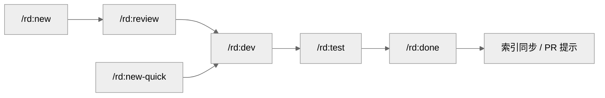
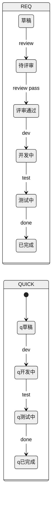

# REQ-006: QUICK 生命周期统一命令链与索引维护

## 元信息

| 属性 | 值 |
|-----|-----|
| 编号 | REQ-006 |
| 类型 | 全栈 |
| 状态 | 草稿 |
| 模块 | 插件架构 |
| 优先级 | P2 |
| 创建日期 | 2026-09-16 |
| 负责人 | - |
| branch | - |
| issue | - |

## 生命周期

<!-- 需求状态流转：草稿 → 待评审 → 评审通过 → 开发中 → 测试中 → 已完成 -->

- [x] 草稿（编写中）
- [ ] 待评审
- [ ] 评审通过
- [ ] 开发中
- [ ] 测试中
- [ ] 已完成

---

## 一、需求描述

### 1.1 背景

双轨需求里 QUICK 的四态（草稿 → 方案确认 → 开发中 → 已完成）只在 `new-quick.md` 内部闭环，出了这条命令就没有命令认它：

- `done.md:37` 规定「状态必须为「测试中」，否则报错退出」，而 QUICK 按现有定义永远不会进入「测试中」——按文档字面执行，`/rd:done QUICK-XXX` 必定退出。实际使用中 QUICK-003、QUICK-004、QUICK-005 都以 done 的语义归档，是执行者自行忽略了这条检查，文档与实践已分叉。
- `done.md:36-38` 的未勾选项检查读「测试要点」章节，QUICK 模板对应章节名为「验证方式」，因此对 QUICK 永远匹配不到，未验证项不会告警。QUICK-004 归档时剩余的未实测项是人工发现的。
- `new-quick.md` 一条命令从创建包办到归档：步骤 8 自带开发引导，步骤 9（`:181-201`）自带归档（改状态 + `git mv`，不确认、不检查未勾项、不更新索引、不建 PR、不问 issue）。与 `/rd:dev`、`/rd:done` 构成两套并行实现，而 `dev.md:49-57` 本就支持 QUICK。
- 「方案确认」状态在文件里从未真实存在：`new-quick.md:165` 是「更新状态为「方案确认」→「开发中」」一次写两个状态，`completed/` 下所有 QUICK 的状态只有「草稿」与「已完成」。
- QUICK 号称「跳过评审 + 测试」（`new-quick.md:27`、根 `CLAUDE.md` 双轨表），但模板保留「验证方式」章节，实际是「自测留痕」；`/rd:test` 不读该章节，QUICK 的验证从未走过命令。
- `INDEX.md` 第 3 行自称「由 `/rd:new`、`/rd:done` 自动维护」，但 `new.md:153` 有更新步骤、`done.md` 一步都没有、`new-quick.md` 也没有。结果：REQ-001 完成后长期挂在「进行中」，QUICK-004 / QUICK-005 从创建到归档全程未进索引，最终由 #80 手工补齐。
- `done.md:48-50` 更新 PRD「需求追踪」行，但 QUICK 从未写入 PRD，这一步对 QUICK 是空转。
- `status.md:41-42` 只在 `REQ-XXX-*.md` 中查找，`req.md:76` 的列表也只提取 REQ 编号，QUICK 在状态查询与需求列表中没有位置（`show.md:17` 是唯一明确支持两者的命令）。
- QUICK 状态机散落在 `new-quick.md:24`、`quick-template.md:21-24`、`upgrade.md:65-70`、`dev.md:49-57` 四处，无单一事实源，守卫不校验；目录、状态字段、生命周期复选框、索引之间的一致性完全依赖人工。

### 1.2 目标

- **功能目标**：QUICK 与 REQ 走同一组生命周期命令，唯一差别是 QUICK 没有 `review` 站——`new-quick` 只负责创建，`dev` / `test` / `done` 对两种需求统一处理；QUICK 状态改为 草稿 → 开发中 → 测试中 → 已完成；索引与需求目录始终一致；QUICK 在状态查询与需求列表中与 REQ 同等可见；新增确定性守卫校验需求文档的目录 / 状态 / 生命周期一致性。
- **效果目标**：QUICK 从创建到归档不需要手工改文件；归档后无需人工补索引（本轮 4 条漂移全部由手工修正）；QUICK 的验证项必须经 `/rd:test` 走过，未勾项在 `done` 时必定提示；状态与目录不一致的文档在 PR 阶段即被 CI 拦下。

### 1.3 客户场景

> 记录客户提出的原始业务场景和诉求

- **场景1**：维护者补测完 QUICK-004 / QUICK-005 后执行归档，命令按文档应报错退出，只能手工改状态、手工 `git mv`、手工补 INDEX 与 PRD；未实测的验证项也是人工盯出来的。
- **场景2**：维护者发现 REQ-001 早已完成却仍列在 INDEX「进行中」，QUICK-004 / QUICK-005 在索引中完全不存在，需要单开 PR（#80）修正。
- **场景3**：维护者在会话中问「QUICK 的逻辑是否合理」，逐文件核对后确认是链路缺失而非个例；随后明确「测试环节应该是要的」——QUICK 省的是评审，不是验证。

### 1.4 价值

QUICK 的价值是省掉对齐成本（评审），不是省掉验证。让它走与 REQ 相同的 `dev → test → done`，命令只需维护一套状态流转逻辑，QUICK 的验证项有了强制入口，索引与 PRD 等下游视图的数据源头不再靠人工记忆。守卫把「状态与目录不一致」变成 CI 可拦截的错误，而不是季度性的人工核对。

### 1.5 范围与边界

> 明确本期做什么、不做什么，防止范围蔓延

- **本期包含**：QUICK 状态机改为四态（草稿 / 开发中 / 测试中 / 已完成）并收进 `_storage.md` 作为唯一定义；`new-quick` 缩为创建 + 方案确认，结束提示 `/rd:dev`；`dev.md` QUICK 前置检查表同步；`test.md` 支持 QUICK（验证清单读「验证方式」）；`done.md` 门槛统一为「测试中」、未勾项章节按类型选择、带标注未勾项放行约定；索引与目录一致（方案 A/B 由评审确定）；PRD 追踪范围明确为仅 REQ；`status.md`、`req.md` 支持 QUICK；`upgrade.md` 状态映射随新状态机调整；新增需求文档一致性守卫并接入 CI 与发布前置；根 `CLAUDE.md`、README / 教程三语的双轨描述同步；`quick-template.md` 生命周期同步，changelog 提示下游执行 `/rd:update-template quick`。
- **本期不做**：粒度阈值统一与选型标准换轴、`upgrade.md` 元信息转换表修正（归 QUICK-007）；REQ 侧生命周期调整；`/rd:test` 三阶段回归逻辑本身；changelog / release 对需求的扫描逻辑；给 QUICK 加评审。

### 1.6 干系人

> 除了提出方，还有哪些人会因此变化受影响

| 角色 | 关注点 | 备注 |
|------|-------|------|
| 提出方（维护者） | 一条 QUICK 全程走命令，索引不再手工补 | 本仓库 dogfooding 即时验证 |
| 下游工程师用户 | `new-quick` 不再一口气做到归档，需接 `/rd:dev` → `/rd:test` → `/rd:done` | 行为变更，写进 changelog；本地 quick 模板需更新 |
| `/rd:req`、`/rd:status` 使用者 | QUICK 在列表与状态查询中可见 | 输出格式变化 |
| `/rd:release`、`/rd:changelog` | 归档状态是其纳入需求的依据 | 本期不改其逻辑，但依赖状态字段准确 |
| CI | 新增守卫步骤 | `.github/workflows/check.yml` 增加一项 |

---

## 二、功能清单

> 列出所有功能点，开发完成后勾选

- [ ] **QUICK 状态机四态**：草稿 → 开发中 → 测试中 → 已完成；「方案确认」不再是状态，确认结果记入「开发记录」；`quick-template.md` 生命周期复选框同步为四项
- [ ] **状态机单一事实源**：`_storage.md` 新增「双轨状态机」小节，集中定义 REQ 六态与 QUICK 四态及各状态由哪条命令写入；`new-quick.md`、`dev.md`、`upgrade.md`、根 `CLAUDE.md` 改为引用
- [ ] **new-quick 只创建**：保留编号、模板、方案生成与确认；确认后状态写「草稿」并提示 `/rd:dev QUICK-XXX`；删除步骤 8 的开发引导与步骤 9 的归档
- [ ] **dev 支持新状态机**：QUICK 前置检查表改为 草稿 / 开发中 / 测试中 允许、已完成 警告；首次进入写「开发中」
- [ ] **test 支持 QUICK**：验证清单按类型读取——REQ 读「六、测试要点」，QUICK 读「验证方式」；交互验证逐项引导并勾选；完成后状态写「测试中」；回归阶段照旧按 `testing.md`，`--skip-*` 可跳过
- [ ] **done 门槛统一**：REQ 与 QUICK 均要求「测试中」；未勾项检查按类型选章节；带标注的未勾项（`- [ ] xxx（待观察：…）` / `（未实测：…）`）直接放行并在输出中列出，裸 `- [ ]` 要求确认
- [ ] **索引与目录一致**：二选一，由评审确定——方案 A（推荐）`/rd:req` 按 `active/`、`completed/` 实时渲染索引，删除 `INDEX.md` 持久化文件与「自动维护」声明，`fix.md` 的关联匹配改为扫描 `active/` 标题行；方案 B `done.md` 与 `new-quick.md` 各补索引写入步骤
- [ ] **PRD 追踪范围明确**：PRD「需求追踪」仅跟踪 REQ；QUICK 静默跳过且不报错，在 `done.md` 中写明
- [ ] **status / req 支持 QUICK**：`status.md` 查找路径与输出覆盖 `QUICK-XXX-*.md`（进度栏显示「验证方式」）；`/rd:req` 分组展示包含 QUICK
- [ ] **upgrade 状态映射随新状态机**：草稿 → 草稿、开发中 → 开发中、测试中 → 测试中、已完成不允许；新 REQ 的评审记录追加「升级自 QUICK-XXX，未经评审」
- [ ] **需求文档一致性守卫**：新增 `scripts/check-requirements.py`（或并入 `check-layout.py`）：`completed/` 内状态必须为「已完成」且 `active/` 内不得为「已完成」；元信息状态与生命周期复选框一致；编号唯一且两目录不重复；若索引持久化则与目录一致。接入 `check.yml` 与 `/rd:release` 发布前置
- [ ] **文档同步**：根 `CLAUDE.md` 双轨表与状态流转行、README / 教程三语中 QUICK 生命周期描述、`new-quick.md` 的「与正式需求的区别」表

---

## 三、业务规则

| 类型 | 规则 | 说明 |
|------|-----|------|
| 状态转换 | QUICK：草稿 → 开发中（`dev`）→ 测试中（`test`）→ 已完成（`done`）；REQ 在草稿与开发中之间多出 待评审 → 评审通过（`review`） | 状态只由对应命令写入，`new-quick` 只写「草稿」 |
| 状态转换 | `done` 对两种需求统一要求「测试中」 | 依据文件名前缀判定类型，仅用于选择验证章节 |
| 状态转换 | 已在 `completed/` 的需求再次归档时提示并退出 | 避免重复 `git mv` 与状态回写 |
| 数据校验 | 验证章节按类型：REQ「六、测试要点」/ QUICK「验证方式」 | `test` 与 `done` 共用此规则；章节缺失视为无检查项 |
| 数据校验 | 未勾项放行：括号内含「待观察」「未实测」标注的 `- [ ]` 放行并列出；裸 `- [ ]` 要求确认 | 标注格式写进模板注释 |
| 数据校验 | 守卫在 PR 与发布前置执行，任一不一致即失败退出 1 | 与 `check-layout.py` 同级 |
| 权限控制 | `readonly` 仓库不执行 `test` / `done` 的文档写入 | 与既有角色规则一致 |
| 非功能约束 | 索引方案无论 A/B，都不得出现「文件声明自动维护但无人写入」的状态 | 本需求的根因之一 |
| 非功能约束 | `new-quick` 行为变更、模板变更、（若方案 A）`INDEX.md` 删除均写入 changelog 破坏性/行为变更段 | 下游可能依赖旧行为 |

---

## 四、使用场景

### 场景1：QUICK 全流程

- **角色**：工程师
- **前置条件**：已初始化需求项目
- **基本流程**：
  1. `/rd:new-quick 标题` → 生成编号、写文档、AI 出方案、用户确认 → 状态「草稿」，提示 `/rd:dev QUICK-XXX`
  2. `/rd:dev QUICK-XXX` → 切分支、状态「开发中」、逐步实现
  3. `/rd:test QUICK-XXX` → 回归（可 `--skip-*`）+ 按「验证方式」逐项交互验证 → 状态「测试中」
  4. `/rd:done QUICK-XXX` → 检查未勾项 → 归档、索引同步、建 PR 提示
- **异常流程**：
  - 「开发中」直接 `/rd:done` → 提示先执行 `/rd:test`
  - 「验证方式」有裸未勾项 → 展示并要求确认；带「待观察」标注的放行并列出
  - 文档已在 `completed/` → 提示已归档，不重复执行

### 场景2：查看与列出 QUICK

- **角色**：工程师
- **前置条件**：仓库内存在 QUICK 需求
- **基本流程**：
  1. `/rd:status QUICK-XXX` → 展示状态、生命周期、验证方式进度
  2. `/rd:req` → QUICK 与 REQ 同时出现，按状态分组
- **异常流程**：
  - 编号不存在 → 提示可用操作（与 REQ 未找到时一致）

### 场景3：守卫拦截不一致

- **角色**：维护者
- **前置条件**：某需求文档被手工移动或改状态
- **基本流程**：
  1. 提 PR → CI 运行守卫 → 报出「`completed/QUICK-00X` 状态为开发中」并失败
  2. 修正后重推 → 通过
- **异常流程**：
  - 本地 `/rd:release` 前置同样拦截，提示先修正

---

## 五、数据与交互

> 根据需求类型填写不同内容：
> - **后端 / 全栈**：描述需要的接口能力和业务语义，技术方案在 `/rd:dev` 阶段生成
> - **前端**：描述页面交互逻辑，`/rd:dev` 阶段自动匹配后端接口

### 后端/全栈：接口需求

| 能力 | 输入 | 输出 | 说明 |
|------|------|------|------|
| 创建快速需求 | `/rd:new-quick [标题]` | 文档（状态草稿）、方案摘要、下一步提示 | 不再进入开发与归档 |
| 开发 | `/rd:dev <编号>` | 分支、状态开发中、实现 | 已支持 QUICK，仅前置表调整 |
| 测试 | `/rd:test <编号> [--skip-*]` | 回归结果、验证清单勾选、状态测试中 | QUICK 读「验证方式」 |
| 归档 | `/rd:done <编号>` | 归档结果、索引同步、未勾项列表 | 门槛统一「测试中」 |
| 查看状态 / 列表 | `/rd:status <编号>`、`/rd:req` | 状态与进度 / 分组列表 | 两种编号一视同仁 |
| 一致性守卫 | `python3 scripts/check-requirements.py --check` | 不一致清单，退出码 | CI 与发布前置调用 |

### 前端：交互逻辑

> 按页面/模块描述用户操作和数据流转，不指定具体接口

不涉及：DevFlow 为 CLI 插件，无页面交互。

---

## 六、测试要点

### 6.1 技术测试

- [ ] 测试点1：`/rd:new-quick` 确认方案后状态为「草稿」，结束提示为 `/rd:dev`，不切分支、不改代码、不 `git mv`
- [ ] 测试点2：`/rd:test QUICK-XXX` 读取「验证方式」逐项引导，完成后状态「测试中」，勾选写回文档
- [ ] 测试点3：对「开发中」的 QUICK 或 REQ 执行 `/rd:done` → 均提示先 `/rd:test`；对「测试中」的 → 正常归档
- [ ] 测试点4：「验证方式」含裸未勾项 → 要求确认；仅含带标注未勾项 → 放行并列出
- [ ] 测试点5：归档后索引与 `active/`、`completed/` 一致（方案 A 为渲染结果，方案 B 为文件内容）
- [ ] 测试点6：`/rd:status QUICK-XXX` 与 `/rd:req` 正确展示 QUICK
- [ ] 测试点7：守卫——人为把 `active/` 某文档状态改为「已完成」、或把「测试中」文档移到 `completed/`、或复制一个重复编号 → 各被报出并退出 1；恢复后通过
- [ ] 测试点8：`/rd:upgrade` 对「开发中」QUICK 生成 REQ，状态「开发中」，评审记录含「升级自 QUICK-XXX，未经评审」
- [ ] 测试点9：`check-layout.py --check`、新守卫、diag 冒烟、CI 全部通过

### 6.2 验收标准

> 产品/业务方验收时的确认项，描述可观测的业务结果

- [ ] 验收项1：一条 QUICK 用 `new-quick → dev → test → done` 四条命令走完，全程不手工改文件
- [ ] 验收项2：归档完成后 `/rd:req` 中该需求出现在已完成分组，不再出现在进行中
- [ ] 验收项3：仓库内不存在「声明自动维护但无人写入」的索引文件
- [ ] 验收项4：根 `CLAUDE.md`、README / 教程三语中 QUICK 生命周期描述为四态且与实现一致
- [ ] 验收项5：CI 在状态与目录不一致的 PR 上失败

---

## 七、图示（可选）

> 用 Mermaid 绘制，GitHub/Gitea 原生渲染。主题建议统一用 `neutral`（打印友好、明暗模式兼容）。

### 7.1 流程图（业务流程、用户操作路径）

### 7.3 ER 图 / 状态图（按需）

---

## 八、评审记录

| 日期 | 评审人 | 结论 | 意见 |
|-----|-------|------|------|
| - | - | - | - |

---

## 九、变更记录

| 日期 | 变更内容 | 影响范围 |
|-----|---------|---------|
| 2026-09-16 | 初始版本 | - |
| 2026-09-16 | 按维护者意见「测试环节应该是要的」重构范围：QUICK 接入 `test`，状态机改四态，`new-quick` 缩为创建，新增一致性守卫；标题由「需求归档链路补齐 QUICK 与索引维护」改为现名 | 一~七章 |

---

## 十、关联信息

- **关联需求**：QUICK-007（粒度阈值与选型标准换轴、`upgrade` 元信息转换修正；与本需求无共同文件，先后无关）；REQ-005（PR 子命令合并，同属命令结构治理）
- **相关文档**：`plugins/rd/commands/new-quick.md`、`dev.md`、`test.md`、`done.md`、`status.md`、`req.md`、`upgrade.md`、`fix.md`、`plugins/rd/shared/_storage.md`、`plugins/rd/templates/quick-template.md`、`plugins/rd/scripts/validate-requirement.sh`、`scripts/check-layout.py`、`.github/workflows/check.yml`、`docs/requirements/INDEX.md`、`docs/requirements/PRD.md`、根 `CLAUDE.md`
- **假设**：下游用户没有脚本依赖 `INDEX.md` 文件路径（方案 A 的前提）；仓库内唯一读取该文件的是 `fix.md:84` 的关联匹配；`/rd:test` 的三阶段回归在 QUICK 上可通过 `--skip-*` 降到只做交互验证
- **外部依赖**：无
- **风险项**：`new-quick` 不再一口气做完，习惯旧行为的用户会在确认方案后停下（缓解：结束语明确下一步命令，changelog 写明）；方案 A 删除 `INDEX.md` 属破坏性变更（缓解：changelog 写明，`fix.md` 同步改）；模板变更需下游 `/rd:update-template quick`，旧模板的五格生命周期不影响守卫（守卫只比对状态与已勾格）；守卫误报会阻塞 PR（缓解：规则只做 grep 级精确匹配，先在本仓库全量跑通再接 CI）

---

## 十一、实现方案

> 本章节在 `/rd:dev` 阶段由 AI 分析代码后自动生成，创建需求时无需填写。

### 11.1 数据模型

_开发阶段填充_

### 11.2 API 设计

> 基于第五章接口需求，结合项目代码和 CLAUDE.md API 风格，生成具体技术方案

_开发阶段填充_

### 11.3 文件改动清单

_开发阶段填充_

### 11.4 实现步骤

_开发阶段填充_
