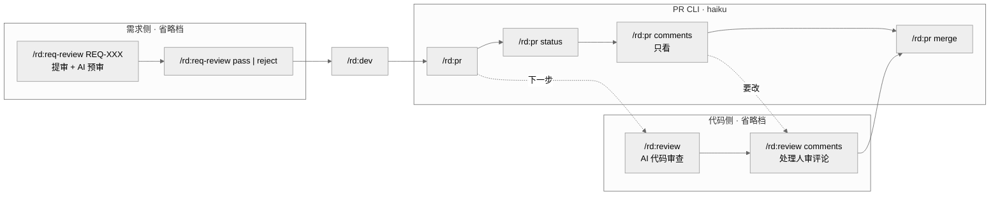

# REQ-007: review 命令按模型档位重组

## 元信息

| 属性 | 值 |
|-----|-----|
| 编号 | REQ-007 |
| 类型 | 全栈 |
| 状态 | 评审通过 |
| 模块 | 插件架构 |
| 优先级 | P2 |
| 创建日期 | 2026-09-18 |
| 负责人 | - |
| branch | feat/REQ-007-review-model-tier-split |
| issue | - |

## 生命周期

<!-- 需求状态流转：草稿 → 待评审 → 评审通过 → 开发中 → 测试中 → 已完成 -->

- [x] 草稿（编写中）
- [x] 待评审
- [x] 评审通过
- [ ] 开发中
- [ ] 测试中
- [ ] 已完成

---

## 一、需求描述

### 1.1 背景

rd 插件里「review」一词同时指两件事：`/rd:review` 是需求评审（PM 用，提审 / pass / reject，钉 haiku），`/rd:pr review` 是 AI 代码审查（工程师用，省略档，正文在 `shared/pr-ops.md`）。REQ-005 把 `review-pr` 并入 `/rd:pr` 时已经点出这个歧义，但明确「本期不做 `/rd:review` 改名」。

歧义之外还有一个档位错配：`/rd:pr` 四个子命令里 create / status / merge 都是 CLI 包装，本该 haiku；只因为 `review` 和 `comments` 需要读代码做判断，整条命令被迫留在省略档（会话模型为 Fable 5.1 时是 haiku 的 10 倍单价）。反过来，需求评审提审时要出「评审摘要 / 影响范围 / 风险评估」，这是需要推理的活，却被钉在 haiku 上只能做章节完整性打勾。

命令 frontmatter 的 `model` 是命令层唯一的成本杠杆、且一条命令只能钉一档，所以按「需要什么模型」切命令，比按「review 这个词」归类更站得住脚。

### 1.2 目标

- **功能目标**：
  1. 需求评审改名为 `/rd:req-review`，去掉 haiku 钉档，提审时由 AI 做真评审（合理性 / 粒度 / 冲突 / 风险），不再只是完整性打勾。
  2. `/rd:review` 改为代码审查专用命令，承接原 `/rd:pr review`（AI 审），并新增 `comments` 子命令按人审评论改代码，省略档。
  3. `/rd:pr` 留 create / status / comments / merge，钉 haiku；`comments` 收窄为只读：拉取、过滤、分组展示评论清单，不改代码。
- **效果目标**：`/rd:pr` 建 PR / 看状态 / 合并三条高频路径成本降到 haiku 档；需求提审输出可供评审人直接采信的 AI 预审意见；斜杠菜单里 review 只对应一件事。

### 1.3 客户场景

> 记录客户提出的原始业务场景和诉求

- **场景1**：维护者看到 `/rd:review` 和 `/rd:pr review` 并列，觉得有歧义，希望「审查」用 review 命令本身。
- **场景2**：维护者指出 review 需要按场景调度不同模型，应该是独立命令；`pr` 可以用更低的模型，需求评审反而需要高级模型思考。

### 1.4 价值

- 三条命令各自钉在与推理强度匹配的档位，符合 CLAUDE.md「模型分级三档」的原则，不再有为了一个子命令拖高整条命令档位的情况。
- 需求评审真正成为质量闸门：升档后能在提审时发现方案不合理、粒度过大、与已有需求冲突等问题，而不是等到 `/rd:dev` 才暴露。
- 命令语义收敛：review = 审查代码，req-review = 评审需求，pr = PR 的 CLI 操作。

### 1.5 范围与边界

> 明确本期做什么、不做什么，防止范围蔓延

- **本期包含**：
  - 新建 `commands/req-review.md`（省略 model）：原 `review.md` 全部场景 + 提审时的 AI 预审。
  - 重写 `commands/review.md`（省略 model）：`/rd:review [PR-ID|REQ-XXX] [--level] [--auto]` 与 `/rd:review comments [PR-ID]`，AI 审查正文从 `shared/pr-ops.md` 迁入；`comments` 的拉取 / 过滤引用 `pr-ops.md` 的 comments 节，分析与修改步骤写在 `review.md`。`pr-ops.md` 保留通用前置 / status / comments（拉取 + 过滤 + 展示）/ merge / Git Flow 双 PR / 与 release 的关系。
  - `commands/pr.md` 子命令表删 review、`comments` 改为只读展示，加 `model: claude-haiku-4-5-20251001`；`/rd:pr review` 不执行，提示改用 `/rd:review` 后退出。
  - `/rd:review` 收到 `pass` / `reject` 参数时不执行，提示改用 `/rd:req-review` 后退出（防老习惯误触代码审查）。
  - `/rd:migrate` 2C 新增映射；`natural-language-dispatcher` 意图表改映射。
  - 全仓引用替换：README 三语、tutorial 三语、CLAUDE.md（模型分级表边界例外、状态流转、大 PR 段落）、`shared/_storage.md` `_template.md` `_delegate.md` `_verify.md`、`commands/dev.md` `new.md` `edit.md` `req.md` `fix.md` `done.md`、`templates/prompt-snippets/pr-review.md` `prompt-craft.md`、`schemas/prompt-schema.md`、`docs/design/token-optimization.md`。
- **本期不做**：
  - 代码审查流程本身的规则不动（文件分类、档位打分、`/code-review` 转调、评论提交），只搬家。
  - 评论的拉取与过滤规则不动；分析 + 修改代码这一段原样成为 `/rd:review comments` 的后半段。
  - 不为 `/rd:pr review` 保留可执行别名（pr 已降 haiku，别名会把代码审查跑在 haiku 上）。
  - QUICK 不进评审的规则不变，`/rd:req-review` 仍只对 REQ 生效。
  - 不改 `changelog` / 已完成需求文档中的历史引用。

### 1.6 干系人

> 除了提出方，还有哪些人会因此变化受影响

| 角色 | 关注点 | 备注 |
|------|-------|------|
| 提出方（维护者） | 命令语义清晰、档位与推理强度匹配 | - |
| 下游用户（PM） | `/rd:review` 变成代码审查，老习惯 `/rd:review REQ-XXX pass` 必须有明确提示 | 靠参数守卫 + `/rd:migrate` 映射 |
| 下游用户（工程师） | `/rd:pr review` 改名；`/rd:pr comments` 变只读，改代码要走 `/rd:review comments` | `/rd:pr` 成功提示、`/rd:fix --auto` 结束提示、`pr comments` 末尾提示同步改 |
| 发布 | 命令改名是 breaking change | rd 升大版本，marketplace 随之升大版本 |

---

## 二、功能清单

> 列出所有功能点，开发完成后勾选

- [ ] **功能点1 req-review 命令**：新建 `commands/req-review.md`，frontmatter 省略 `model`，`argument-hint` 为 `[REQ-XXX] [pass|reject] [--comment=评审意见]`，三个场景（提审 / 通过 / 驳回）与原 `review.md` 一致。
- [ ] **功能点2 AI 预审**：提审场景在完整性检查之后增加「AI 预审」步骤：读全文，输出方案合理性、粒度（是否该 `/rd:split`）、与 `active/` `completed/` 已有需求的冲突或重叠、风险与遗漏四个维度的意见，分「阻塞 / 建议 / 信息」三级；有阻塞项时询问是否仍提审；无论是否提审，预审意见以「AI 预审」一行写入「八、评审记录」，供评审人 pass / reject 时参考。
- [ ] **功能点3 review 命令重写**：`commands/review.md` 改为代码审查：无子命令 = AI 审查（原 `pr-ops.md` review 节 1–7 步原样迁入），`comments` 子命令 = 按 `pr-ops.md` comments 节拉取 / 过滤 / 展示，再逐条读引用源码 ±20 行、判断可执行 / 需讨论、生成修改方案、用户确认后执行（原 comments 节第 3 步的分析与修改部分迁入本文）；通用前置（定位 PR、gh 可用性判定）在本文内保留一份；`allowed-tools` 含 `Bash(git:*, gh:*, tea:*, curl:*)`、`Agent`、`Skill`；省略 `model`。
- [ ] **功能点4 review 参数守卫**：参数含 `pass` / `reject`，或形如 `REQ-XXX pass` → 输出「需求评审已改为 /rd:req-review REQ-XXX pass」并退出，不进代码审查。
- [ ] **功能点5 pr 降档**：`commands/pr.md` 加 `model: claude-haiku-4-5-20251001`；子命令表留 status / comments / merge，`review` 命中时输出「已改为 /rd:review」并退出；`comments`（含 `fetch-comments`）收窄为只读：拉取、过滤、按整体 / 行内分组展示清单，末尾提示「要按评论改代码：/rd:review comments」，不读源码、不生成方案；`pr-ops.md` 删除 review 节，comments 节只保留拉取 / 过滤 / 展示（去掉分析与修改），首行说明改为「status / comments / merge」；`allowed-tools` 去掉 `Skill`（不再转调 `/code-review`），`Agent` 按 merge / status 是否委派决定。
- [ ] **功能点6 下一步提示同步**：`/rd:pr` 创建成功输出、`/rd:fix --auto` 结束提示、`/rd:done` 建 PR 提示中的 `/rd:pr review` 改为 `/rd:review`；`/rd:new` `/rd:edit` `/rd:dev` `/rd:req` 中的 `/rd:review` 改为 `/rd:req-review`。
- [ ] **功能点7 migrate 映射**：`/rd:migrate` 2C 新增：`/rd:review`（任意参数，旧语义只有需求评审）→ `/rd:req-review`；`/rd:pr review` → `/rd:review`；原 `/req:review-pr review` → `/rd:review`（替换掉现有映射到 `/rd:pr review` 的一条）；`/req:review` → `/rd:req-review`。`/rd:pr comments` / `/req:review-pr fetch-comments` 保持映射到 `/rd:pr comments`（命令仍在，只是变只读），不新增映射。
- [ ] **功能点8 自然语言调度**：`natural-language-dispatcher` 三、四两节改映射：评审通过 / 驳回 + 编号 → `/rd:req-review pass|reject`，新增「提审 / 提交评审」+ 编号 → `/rd:req-review`；审 PR → `/rd:review`；「看看 PR 评论」「拉 PR 评论」→ `/rd:pr comments`，「处理 PR 反馈」「按评论改」→ `/rd:review comments`；`--auto` 触发词说明改指 `/rd:review`。
- [ ] **功能点9 文档与守则同步**：README 三语命令表与快速开始、tutorial 三语（含流程图、自然语言映射表、13.3 `--auto` 章节、命令速查表）、CLAUDE.md（模型分级表：haiku 边界例外去掉 `review` 加 `pr`；「大 PR 代码质量审查」段与「状态流转」段改命令名；插件全景不变）、`shared/_storage.md` 双轨状态机表、`_template.md`、`_delegate.md`、`_verify.md`、`templates/prompt-snippets/pr-review.md` 与 `prompt-craft.md`、`schemas/prompt-schema.md`、`docs/design/token-optimization.md`。
- [ ] **功能点10 布局与一致性守卫通过**：`scripts/check-layout.py --check` 与 `scripts/check-requirements.py --check` 通过；全仓（排除 `docs/changelogs/`、`docs/requirements/completed/`、本文档）不再出现 `/rd:pr review`、需求评审语义的 `/rd:review`；`/rd:pr comments` 的出现处语义均为只读查看。

---

## 三、业务规则

| 类型 | 规则 | 说明 |
|------|-----|------|
| 命令语义 | `/rd:review` 只做代码审查（AI 审 / 按人审评论改代码）；`/rd:req-review` 只做需求评审；`/rd:pr` 只做 create / status / comments（只读）/ merge | 一个词一个含义，参数形态不再承担区分职责 |
| 评论分工 | `/rd:pr comments` 与 `/rd:review comments` 并存：前者只拉取展示，后者拉取后改代码；拉取与过滤规则只在 `pr-ops.md` 写一份，两者引用 | 看评论用 haiku，改代码用会话模型，按需选 |
| 模型分级 | `req-review` 省略档、`review` 省略档、`pr` haiku | 按推理强度分档；`req-review` 的 pass / reject 虽是状态流转，但与提审共享一条命令，随命令走省略档，属可接受的边界例外，需在 CLAUDE.md 模型分级表注明 |
| 参数守卫 | `/rd:review` 见到 `pass` / `reject` 立即提示并退出；`/rd:pr review` 立即提示并退出 | 两条守卫都不执行任何流程，只输出一行新命令；`--auto` 上游（`/rd:fix --auto`）已改指新命令，不会撞守卫 |
| 状态转换 | `/rd:req-review` 的状态流转与原 `/rd:review` 完全一致（草稿 / 评审驳回 → 待评审 → 评审通过 / 评审驳回） | 状态机唯一定义在 `_storage.md`，只改命令名不改流转 |
| AI 预审 | 预审只产出意见，不改状态；阻塞项存在时由用户决定是否仍提审；预审结果落「八、评审记录」，评审人=`AI 预审`、结论=`提审`，意见为精简摘要 | Memory 隔离约束不变：预审不得改文档结构与内容，只追加评审记录一行 |
| 兼容 | `/rd:pr review` 不提供可执行别名；`/rd:pr comments` 命令保留但行为收窄 | `/rd:pr` 已是 haiku，别名会把代码审查跑在 haiku 上；旧写法靠守卫提示 + `/rd:migrate` 替换；老用户敲 `/rd:pr comments` 仍能看到评论，末尾提示才是改代码入口 |
| 仓库角色 | `/rd:review` 与 `/rd:pr` 不受 `requirementRole` 限制（继承现状）；`/rd:req-review` 为写操作，readonly 仓库按原 `review.md` 规则处理 | 原 `review.md` 未显式处理 readonly，本期沿用 `_storage.md` 规则不新增逻辑 |
| 非功能约束 | `review.md` 迁入两节后单文件 < 30 KB；`pr.md` 加守卫后不超过 10 KB；`req-review.md` 加预审后 < 10 KB | Token 节约规则 |
| 发布 | 命令改名为 breaking change，rd 5.x → 6.0.0，marketplace 4.x → 5.0.0 | 由 `version-bumper` 在 `/rd:release` 时按 semver 推导，本文只记预期 |

---

## 四、使用场景

### 场景1：工程师审查 PR

- **角色**：工程师
- **前置条件**：已在功能分支执行 `/rd:pr` 创建 PR
- **基本流程**：
  1. 执行 `/rd:review` → 命令从当前分支定位 PR，按文件分类判定规模，小 PR 内联审查、大 PR 转调 `/code-review`
  2. 输出审查报告（阻塞 / 建议 / 信息 + 需求文档同步）→ 展示精简版预览，询问是否提交评论
  3. 无阻塞且有审核人 → 询问是否 Approve；无审核人 → 提示 `/rd:pr merge`
- **异常流程**：
  - 参数含 `pass` / `reject` → 提示改用 `/rd:req-review`，退出
  - 未找到 PR → 提示先 `/rd:pr`

### 场景2：工程师查看与处理人工审查评论

- **角色**：工程师
- **前置条件**：PR 上有他人评论
- **基本流程**：
  1. 只想看：执行 `/rd:pr comments` → 拉取整体评论与行内评论，过滤本人 / AI / 已 resolved，按整体 / 行内分组展示清单，末尾提示「要按评论改代码：/rd:review comments」
  2. 要改：执行 `/rd:review comments` → 同样拉取过滤 → 逐条读引用源码 ±20 行，判断可执行 / 需讨论，生成修改方案 → 用户确认后执行
- **异常流程**：
  - 无可处理评论 → 两条命令都提示并退出
  - `/rd:pr comments` 下用户说「改吧」→ 提示改用 `/rd:review comments`，haiku 档不改代码

### 场景3：PM 提审需求并得到 AI 预审

- **角色**：产品经理
- **前置条件**：需求状态为「草稿」或「评审驳回」
- **基本流程**：
  1. 执行 `/rd:req-review REQ-XXX` → 完整性检查通过 → AI 读全文与已有需求，输出四维度预审意见
  2. 无阻塞 → 生成评审摘要 → 状态改「待评审」→ 「八、评审记录」追加「AI 预审」一行
  3. 评审人执行 `/rd:req-review REQ-XXX pass` 或 `reject` → 与原流程一致
- **异常流程**：
  - 预审有阻塞项 → 询问「仍要提审吗」，选否则保持草稿并提示 `/rd:edit`
  - 完整性检查失败 → 与原流程一致，提示 `/rd:edit`

### 场景4：老用户用旧写法

- **角色**：任意
- **前置条件**：习惯了 v5 及以前的命令
- **基本流程**：
  1. 输入 `/rd:review REQ-001 pass` → 守卫提示 `/rd:req-review REQ-001 pass`，退出
  2. 输入 `/rd:pr review` → 守卫提示 `/rd:review`，退出；输入 `/rd:pr comments` → 正常展示清单，末尾指向 `/rd:review comments`
  3. 项目内文档 / 脚本含旧写法 → 执行 `/rd:migrate`，2C 按映射替换
- **异常流程**：
  - 输入 `/rd:review` 且当前分支无 PR → 走代码审查的「未找到 PR」提示，不会误入需求评审

---

## 五、数据与交互

> 根据需求类型填写不同内容：
> - **后端 / 全栈**：描述需要的接口能力和业务语义，技术方案在 `/rd:dev` 阶段生成
> - **前端**：描述页面交互逻辑，`/rd:dev` 阶段自动匹配后端接口

### 后端/全栈：接口需求

| 能力 | 输入 | 输出 | 说明 |
|------|------|------|------|
| 代码审查 | `/rd:review [PR-ID\|REQ-XXX] [--level=low\|medium\|high] [--auto]` | 审查报告、PR 评论、可选 Approve | 原 `/rd:pr review`，规则原样 |
| 查看审查评论 | `/rd:pr comments [PR-ID]` | 分组评论清单 | 只读，haiku；原 `/rd:pr comments` 的前半段 |
| 处理审查评论 | `/rd:review comments [PR-ID]` | 修改清单并应用 | 原 `/rd:pr comments` 的全流程 |
| 需求提审 | `/rd:req-review [REQ-XXX]` | AI 预审意见 + 评审摘要 + 状态待评审 | 原 `/rd:review` + 新增预审 |
| 需求通过 / 驳回 | `/rd:req-review REQ-XXX pass\|reject [--comment=]` | 评审记录、状态流转 | 原样 |
| PR CLI 操作 | `/rd:pr [REQ-XXX]` / `status` / `merge` | 建 PR / 状态 / 合并 | 降 haiku |
| 旧写法守卫 | `/rd:review … pass\|reject`、`/rd:pr review` | 一行提示后退出 | 不执行任何流程 |
| 旧写法迁移 | `/rd:migrate` | 替换汇总 | 2C 新增映射 |

### 前端：交互逻辑

> 本需求无前端页面，本节不适用。

**页面：无**

| 操作/区域 | 用户行为 | 数据需求 | 交互反馈 |
|----------|---------|---------|---------|
| - | - | - | - |

---

## 六、测试要点

### 6.1 技术测试

- [ ] 测试点1：`claude plugin details rd` 的命令清单出现 `review`、`req-review`、`pr`，且 `review` 的 description 为代码审查、`req-review` 为需求评审
- [ ] 测试点2：`plugins/rd/commands/pr.md` frontmatter 含 `model: claude-haiku-4-5-20251001`；`review.md` 与 `req-review.md` 不含 `model`
- [ ] 测试点3：`/rd:review REQ-007 pass` 只输出改用 `/rd:req-review` 的提示，不拉 diff、不改文档
- [ ] 测试点4：`/rd:pr review` 只输出改用 `/rd:review` 的提示，不执行审查；`/rd:pr comments` 展示分组评论清单后停止，不读源码、不改文件，末尾提示 `/rd:review comments`
- [ ] 测试点5：在有 PR 的功能分支执行 `/rd:review`，输出与改名前 `/rd:pr review` 一致的报告结构（档位行、文件分类行、三级问题、需求文档同步）
- [ ] 测试点6：`/rd:req-review REQ-007` 提审时输出四维度预审意见，「八、评审记录」新增「AI 预审」一行，状态变为待评审
- [ ] 测试点7：`/rd:migrate` 2C 对 `/rd:review REQ-001 pass`、`/rd:pr review`、`/req:review-pr review` 三种旧写法按映射替换；`/rd:pr comments` 不被替换
- [ ] 测试点8：`python3 scripts/check-layout.py --check` 与 `python3 scripts/check-requirements.py --check` 通过
- [ ] 测试点9：全仓 grep（排除 changelog / completed / 本文档）无 `/rd:pr review`，`/rd:review` 只出现在代码审查语境，`/rd:pr comments` 只出现在只读查看语境

### 6.2 验收标准

> 产品/业务方验收时的确认项，描述可观测的业务结果

- [ ] 验收项1：在一个功能分支上依次执行 `/rd:pr`、`/rd:review`、`/rd:pr comments`、`/rd:review comments`、`/rd:pr merge`，PR 创建 / 审查 / 看评论 / 按评论改 / 合并全链路走通，`/rd:pr` 成功提示的下一步为 `/rd:review`
- [ ] 验收项2：对本需求执行 `/rd:req-review REQ-007` → `pass`，预审意见可读、评审记录有「AI 预审」与人工「通过」两行
- [ ] 验收项3：README 三语、tutorial 三语的命令表与流程图中 review / req-review / pr 三条命令职责与本文一致
- [ ] 验收项4：说「审一下这个 PR」映射 `/rd:review`，说「看看 PR 评论」映射 `/rd:pr comments`，说「按评论改一下」映射 `/rd:review comments`，说「REQ-007 评审通过」映射 `/rd:req-review REQ-007 pass`，说「提审 REQ-007」映射 `/rd:req-review REQ-007`

---

## 七、图示（可选）

### 7.1 命令职责

---

## 八、评审记录

| 日期 | 评审人 | 结论 | 意见 |
|-----|-------|------|------|
| 2026-09-18 | haiqing | 通过 | 三条命令按档位切分；`/rd:pr comments` 保留为只读查看与 `/rd:review comments` 并存；`/rd:pr review` 不留可执行别名 |

---

## 九、变更记录

| 日期 | 变更内容 | 影响范围 |
|-----|---------|---------|
| 2026-09-18 | 初始版本 | - |
| 2026-09-18 | `/rd:pr comments` 保留为只读查看，与 `/rd:review comments` 并存 | 功能点3/5/7/8、业务规则、场景2/4、测试点4/7/9 |

---

## 十、关联信息

- **关联需求**：REQ-005（PR 命令合并为 `/rd:pr` 子命令，本需求把其中 review / comments 再拆出去）；QUICK-007（QUICK 链路文案，`/rd:fix --auto` 结束提示在此改过）
- **相关文档**：CLAUDE.md「模型分级」「大 PR 代码质量审查不自研」；`shared/_delegate.md`；`docs/design/token-optimization.md`
- **假设**：下游项目对 `/rd:review` / `/rd:pr review` 的引用只存在于文档与自然语言习惯，不存在脚本硬编码，因此守卫提示 + `/rd:migrate` 足以覆盖迁移
- **外部依赖**：无
- **风险项**：
  - 语义翻转风险：`/rd:review` 在 v5 是需求评审、v6 是代码审查，老用户误触概率高于普通改名 → 参数守卫 + README / tutorial 迁移说明 + `/rd:migrate` 三重覆盖
  - 引用面广：估计 100 处上下 → 开发时先 grep 盘点再替换，测试点9 兜底
  - AI 预审的意见质量依赖会话模型 → 预审只产出意见不改状态，误判成本可控

---

## 十一、实现方案

> 本章节在 `/rd:dev` 阶段由 AI 分析代码后自动生成，创建需求时无需填写。

### 11.1 数据模型

_开发阶段填充_

### 11.2 API 设计

> 基于第五章接口需求，结合项目代码和 CLAUDE.md API 风格，生成具体技术方案

_开发阶段填充_

### 11.3 文件改动清单

_开发阶段填充_

### 11.4 实现步骤

_开发阶段填充_
