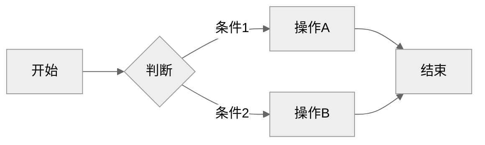
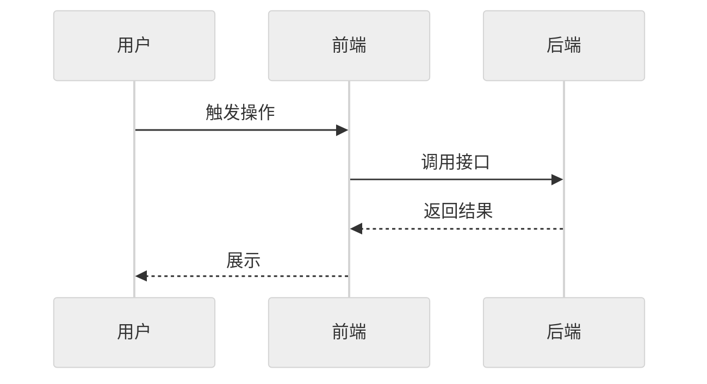
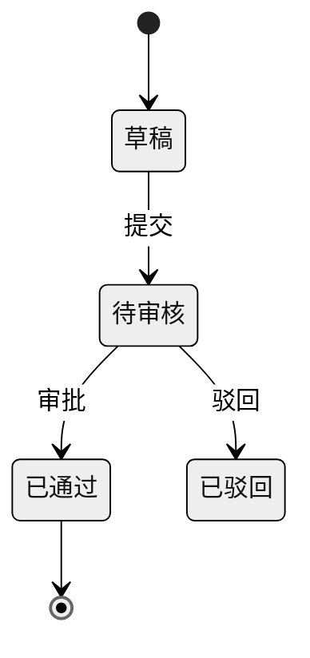

# REQ-008: UI 自主验收：headless 探针代替手动浏览器验证

## 元信息

| 属性 | 值 |
|-----|-----|
| 编号 | REQ-008 |
| 类型 | 全栈 |
| 状态 | 开发中 |
| 模块 | 插件架构 |
| 优先级 | P2 |
| 创建日期 | 2026-09-23 |
| 负责人 | - |
| branch | feat/REQ-008-ui-auto-acceptance,feat/REQ-008-acceptance-fixes |
| issue | - |

## 生命周期

<!-- 需求状态流转：草稿 → 待评审 → 评审通过 → 开发中 → 测试中 → 已完成 -->

- [x] 草稿（编写中）
- [x] 待评审
- [x] 评审通过
- [x] 开发中
- [ ] 测试中
- [ ] 已完成

---

## 一、需求描述

### 1.1 背景

开发完成或测试时，UI 上可观察的验收项目前全靠人工：`/rd:test` 步骤 7「交互验证」逐项引导用户手动验证；`/rd:do`、`/rd:fix` 经 `_verify.md` 在无测试覆盖时派生「手动验证清单」交给用户。用户要自己打开浏览器、操作、截图。

曾经的 uat 插件（REQ-002，v2.30–v2.33）让 AI 作为「指挥家」调用 browser skill 交互式驱动浏览器——点一步、截一张图、再判断，一个场景十几轮，每轮重读全部历史（含截图，每张 1–2K+ token），且只能在特定端运行、能力边界不稳定，v3.0.0（#71）移除。之后 UI 验收退回纯人工。

现有基础可复用：`/rd:test` 阶段三 E2E 回归已委派 `test-runner` 只回摘要；Claude Opus 5.5 读截图 / 图表准确，即使低 effort 也能读对；Playwright 可 headless 运行、截图与 aria 快照落盘、DOM / 文本 / URL 断言。

### 1.2 目标

- **功能目标**：UI 可观察的验收项由 AI 写成 headless Playwright 验收探针自行运行并判定，只有无法自动化的项留给人；探针保留为 E2E 回归资产。
- **效果目标**：主会话每个验收项的开销控制在约 300 token 委派 prompt + 约 80 token 回传；截图与 aria 快照不进主会话；每个 `ui-verifier` 子代理新增内容（读入文件、命令输出、截图、写出的探针）≤ 3 万 token、折合 ≤ $0.25（固定上下文约 1.5 万 token 每轮走缓存重读，不计入），以「每个子代理的花费」而非只看主会话衡量节约效果；可脚本化 / 视觉类验收项不再需要人工打开浏览器。

### 1.3 客户场景

> 记录客户提出的原始业务场景和诉求

- **场景1**：「开发完成或测试时需要打开浏览器操作截图等操作，这个有什么优化的方案吗，能够自我完成测试验收，尽量节约 token」（DevFlow 维护者 / 下游开发者，2026-09-23）
- **场景2**：`/rd:fix` 修完一个前端 bug，希望 AI 自己确认页面行为已恢复，而不是在完成提示里留一条「请手动验证」。

### 1.4 价值

- 下游开发者省去逐项开浏览器验收的人工时间，`/rd:test` → `/rd:done` 链路更接近自动闭环。
- 验收一次性投入：探针保留后，下次 `/rd:test` 阶段三当回归跑，UI 行为回归有自动兜底。
- 相比 uat 的交互式驱动，token 成本数量级下降，且不依赖特定客户端的浏览器能力。

### 1.5 范围与边界

> 明确本期做什么、不做什么，防止范围蔓延

- **本期包含**：
  - 新增执行型 agent `ui-verifier`（写 headless Playwright 探针 → 运行 → 必要时在 agent 内判读截图 → 只回结论）
  - `_verify.md` 新增「自主验收」节（前置条件、分类、派发、回写），供 `/rd:test` 步骤 7、`/rd:do`、`/rd:fix` 共用
  - `/rd:test` 步骤 7 由「交互验证」改为「自主验收」；`/rd:do`、`/rd:fix` 手动验证清单先走自主验收
  - `testing.md` 模板与 prompt-schema 补 E2E 运行命令、前端地址、登录配方、产物目录、服务启动 / 探活
  - `/rd:test_new` E2E 断言规则与探针目录分工；`_delegate.md`、CLAUDE.md、token 指南同步
- **本期不做**：
  - 交互式浏览器驱动（claude-in-chrome / playwright-mcp / puppeteer）
  - Cypress 支持（首版仅 Playwright，Cypress 项目退回手动）
  - 测试账号注入机制（不新增 settings.local 字段，只在 testing.md 写 env 变量名）
  - 修改 `test-runner` 契约；新增命令；改 `/rd:dev`
  - 视觉回归基线（`toHaveScreenshot`）
  - 清理孤立模板 `templates/scripts/test-env.sh`、`templates/tests/e2e/playwright.config.ts`

### 1.6 干系人

> 除了提出方，还有哪些人会因此变化受影响

| 角色 | 关注点 | 备注 |
|------|-------|------|
| 提出方 | 少开浏览器、省 token、AI 自主验收 | DevFlow 维护者 |
| 下游开发者 | `/rd:test`、`/rd:do`、`/rd:fix` 行为变化；需在 testing.md 补 E2E 信息 | 前置不满足时退回手动，不强制 |
| 需求 / 产品验收人 | 6.2 验收标准由 AI 自动勾选，需能追溯证据 | PASS 项附探针路径，FAIL 附截图路径 |

---

## 二、功能清单

> 列出所有功能点，开发完成后勾选

- [x] **ui-verifier agent**：接收一条验证项（入口 / 操作 / 预期 + 模式 script|visual）与 baseURL、登录配方、E2E 命令、探针路径、产物目录、候选前端文件；写 headless Playwright 探针并运行；只回传 PASS / FAIL / BLOCKED + 一句证据 + 探针与产物路径
- [x] **自主验收规则（_verify.md）**：前置三条检查、script / visual / manual 分类、派发（一项一 agent，同页 ≤3 项可合并，独立项并行）、主会话纪律（不读图）、回写写法、验证结果段新增「自主验收」行
- [x] **/rd:test 步骤 7 改造**：交互验证 → 自主验收；报告加「自主验收 n/m」；验收 FAIL 计入失败；`acceptance/` 探针纳入阶段三回归
- [x] **/rd:do、/rd:fix 接入**：手动验证清单中 UI 可观察项先派 `ui-verifier`，剩余才留手动；`/rd:fix --auto` 下自主验收照常执行，FAIL 停下
- [x] **testing.md 模板与 schema**：「必备输入」补 E2E 命令（headless）、前端地址、登录配方（仅 env 变量名）、产物目录、服务启动与探活；schema 加推荐关键词（缺失只警告）
- [x] **/rd:test_new 分工**：E2E 断言只用 DOM / 文本 / URL，不用 `toHaveScreenshot`；流程用例与 `acceptance/` 探针不重复
- [x] **文档同步**：`_delegate.md` 可写型 agent 表与准入说明、CLAUDE.md agent 数量、token-optimization 已应用清单

---

## 三、业务规则

| 类型 | 规则 | 说明 |
|------|-----|------|
| 前置条件 | 自主验收需同时满足：testing.md 有 E2E 运行命令与前端地址；前端可达；框架为 Playwright | 缺任一条 → 全部 UI 项退回手动，结果写「自主验收：未配置（原因）」，不得静默 |
| 分类 | script = 有入口 + 操作 + 可查询预期（文本 / 元素 / URL / 提示）；visual = 预期是样式 / 布局 / 图表 / 动画；manual = 真实第三方、硬件、多人、生产数据或无可观察结果 | 分类由主会话做；非 UI 的可执行验证（HTTP、CLI）主会话直接跑，不派 agent |
| 断言 | 只用 DOM / 文本 / URL / 网络响应断言；禁止 `toHaveScreenshot` | 视觉项只截图后由 agent 判读 |
| 读图 | 需要「看」时先读 aria 快照，不够再读截图，每项最多一张，仅在 agent 内 | 主会话不 Read 任何 png / aria |
| 自修上限 | 选择器超时允许修正重跑 1 次；仍失败为 FAIL；主会话不因 FAIL 重派 | 避免反复烧 token |
| 回写 | PASS → `[x] 原文（自动验收：<spec 路径>）`；FAIL、BLOCKED → 保持裸 `[ ]`，报告写期望 vs 实际或阻塞原因；manual → 引导用户手动验证，通过则勾选，**用户明确选择暂缓**才标 `（未实测：原因）`，否则保持裸 `[ ]` | AI 不自动打「未实测 / 待观察」标注——带标注的项会被 `/rd:done` 放行（REQ-006），只能由人决定暂缓；裸 `[ ]` 由 `/rd:done` 闸门拦下要求确认；readonly 仓库不写回，只在报告列出 |
| 探针留存 | 探针默认保留在 `<E2E 目录>/acceptance/<REQ/QUICK 编号或分支 slug>/`，列入修改文件，是否提交由用户在 commit 时定 | 下次 `/rd:test` 阶段三一并回归 |
| 非功能约束 | 主会话每项 ≈300 token prompt + ≈80 token 回传；每个子代理新增内容 ≤ 3 万 token、折合 ≤ $0.25（超出时记录原因，作为是否调整 effort / 合并策略的依据；同页合并摊薄固定开销）；`ui-verifier` 为 `model: inherit`、`effort: high`；账号只写 env 变量名，不写密钥 | 产物目录缺省 `test-results/acceptance/` |

---

## 四、使用场景

### 场景1：/rd:test 自主验收 REQ 的验收标准

- **角色**：下游开发者
- **前置条件**：REQ 状态为开发中 / 测试中；testing.md 配好 E2E 命令、前端地址、登录配方；项目使用 Playwright
- **基本流程**：
  1. 用户执行 `/rd:test REQ-XXX` → 阶段一~三回归照常执行
  2. 进入步骤 7 → 主会话取「六、测试要点」中自动化未覆盖的项，逐项分类 script / visual / manual
  3. 前端未启动时按 testing.md 启动并探活 → 并行派 `ui-verifier`（每项一个，同页 ≤3 项合并）
  4. 各 agent 回传结论 → PASS 项勾选写回并附探针路径；FAIL 进失败清单并展示证据与截图路径；BLOCKED 保持未勾并列出阻塞原因；manual 项逐项引导用户手动验证（通过勾选，用户选择暂缓才标「未实测」，否则保持未勾）
  5. 报告展示「自主验收 n/m（FAIL n，BLOCKED n）」→ 无失败提示 `/rd:done`，有失败提示 `/rd:dev` 修复
- **异常流程**：
  - testing.md 缺 E2E 命令 / 前端地址，或非 Playwright → 退回逐项手动引导，报告写「自主验收：未配置（原因）」并提示补哪一项
  - 前端起不来 → 同上视为未配置
  - 浏览器未安装 → 该项 BLOCKED，失败要点提示 `npx playwright install`
  - 需登录但无登录配方 → BLOCKED，提示在 testing.md 补登录配方

### 场景2：/rd:fix 修完前端 bug 后自主确认

- **角色**：下游开发者
- **前置条件**：同场景1的前置三条
- **基本流程**：
  1. `/rd:fix` 修改完成 → 按 `_verify.md` 编译 / lint / 相关测试回归
  2. 无测试覆盖时派生手动验证清单 → UI 可观察项派 `ui-verifier`
  3. 完成提示的「手动验证」条目中 PASS 项显示 `[x]（自动验收：<spec>）`，新增「自主验收」一行，只剩 manual 项需要人做
- **异常流程**：
  - 自主验收 FAIL → 按 `_verify.md` 失败处理停下，不进入完成提示；`--auto` 模式下不自动串联后续提交
  - 前置不满足 → 清单原样留给用户，结果段写「自主验收：未配置（原因）」

### 场景3：探针作为回归复用

- **角色**：下游开发者
- **前置条件**：之前的自主验收已在 `<E2E 目录>/acceptance/` 留下探针
- **基本流程**：
  1. 后续改动后执行 `/rd:test` → 阶段三 E2E 回归包含 `acceptance/` 下的探针，由 `test-runner` 运行并只回摘要
- **异常流程**：
  - 页面改版导致探针选择器失效 → 回归报 FAIL，用户按失败清单修探针或删除

---

## 五、数据与交互

> 根据需求类型填写不同内容：
> - **后端 / 全栈**：描述需要的接口能力和业务语义，技术方案在 `/rd:dev` 阶段生成
> - **前端**：描述页面交互逻辑，`/rd:dev` 阶段自动匹配后端接口

### 后端/全栈：接口需求

| 能力 | 输入 | 输出 | 说明 |
|------|------|------|------|
| 委派单项验收（主会话 → ui-verifier） | 工作目录、验证项编号与原文（入口 / 操作 / 预期）、模式 script|visual、baseURL、登录配方（步骤 + env 变量名）、headless E2E 命令、探针输出路径、产物目录、候选前端文件 ≤5 个 | 验证项、结果 PASS|FAIL|BLOCKED、一句证据、探针路径、产物路径、失败要点 ≤5 行 | 全部素材内联进 prompt；不回传日志、文件内容、截图 |
| testing.md 自主验收配置 | E2E 运行命令（headless）、前端地址、登录配方、产物目录、服务启动与探活 | 自主验收前置检查所需事实 | 账号值由下游 `.env.test` / 环境提供，插件不注入 |
| 验收结果写回 | 各项结论 + 用户对 manual 项的验证 / 暂缓决定 | 需求文档验证章节勾选（PASS、手动通过）或用户决定的暂缓标注；验证结果段「自主验收」行 | 章节按 `_storage.md`：REQ「六、测试要点」，QUICK「验证方式」 |

### 前端：交互逻辑

> 按页面/模块描述用户操作和数据流转，不指定具体接口

**页面：XXX**

| 操作/区域 | 用户行为 | 数据需求 | 交互反馈 |
|----------|---------|---------|---------|
| 列表区域 | 进入页面 | 分页数据（字段1、字段2...） | 加载中 → 展示列表 / 空状态 |
| 搜索 | 输入关键词、选择筛选条件 | 按条件过滤列表 | 实时刷新列表 |
| 操作按钮 | 点击审核/删除/导出 | 提交操作结果 | 成功提示 / 失败原因 |

---

## 六、测试要点

### 6.1 技术测试

- [ ] `python3 scripts/check-layout.py --check` 通过（新 agent、新链接可达）
- [ ] `python3 scripts/check-requirements.py --check` 通过
- [ ] `grep -H "^model:\|^effort:" plugins/rd/agents/ui-verifier.md` 为 `inherit` / `high`；rd agent 共 7 个
- [ ] `grep -n "自主验收" plugins/rd/shared/_verify.md plugins/rd/commands/test.md plugins/rd/commands/do.md plugins/rd/commands/fix.md` 四处命中
- [ ] `_verify.md`、`test.md` 等改动文件均 < 30 KB
- [ ] 下游实测跑完自主验收后 `git status` 只多出 `acceptance/` 探针与产物目录文件，无其它改动

### 6.2 验收标准

> 产品/业务方验收时的确认项，描述可观测的业务结果

- [ ] 验收项1：在一个配置齐全的 Playwright 下游项目上执行 `/rd:test REQ-XXX`，步骤 7 自动完成 script 类验收项，需求文档中对应项被勾选并附探针路径，全程无需人工打开浏览器
- [ ] 验收项2：同一次运行中，主会话上下文不出现任何截图或 aria 快照内容，每项只收到结论行
- [ ] 验收项3：一条 visual 类验收项（如「某按钮为禁用灰色」）由 agent 截图判读后返回带观察描述的 PASS / FAIL
- [ ] 验收项4：人为制造一个不符合预期的页面行为，对应项返回 FAIL，需求文档保持裸 `[ ]`，报告给出期望 vs 实际与截图路径，`/rd:done` 被拦下要求确认
- [ ] 验收项5：删除 testing.md 中的前端地址后再跑，自主验收整段退回手动引导，报告写「自主验收：未配置（缺前端地址）」
- [ ] 验收项6：对一个前端 bug 执行 `/rd:fix`，完成提示中 UI 项显示 `[x]（自动验收：<spec>）`
- [ ] 验收项7：再次执行 `/rd:test`，阶段三回归包含 `acceptance/` 下的探针
- [ ] 验收项8：一个需求同时含 script、visual、manual 三类验收项且其中 2–3 项在同一页面时，同页项合并为一个 `ui-verifier`，manual 项进入手动引导而不派子代理；用户不验证也不选择暂缓的 manual 项保持裸 `[ ]`，`/rd:done` 要求确认
- [ ] 验收项9：每个 `ui-verifier` 子代理新增内容 ≤ 3 万 token、折合 ≤ $0.25（从会话记录统计 input + cache_creation 与按价折算）

---

## 七、图示（可选）

> 用 Mermaid 绘制，GitHub/Gitea 原生渲染。主题建议统一用 `neutral`（打印友好、明暗模式兼容）。
> 无图可删除本节，按需保留下方子节。

### 7.1 流程图（业务流程、用户操作路径）



### 7.2 时序图（接口调用链、前后端交互）



### 7.3 ER 图 / 状态图（按需）



---

## 八、评审记录

| 日期 | 评审人 | 结论 | 意见 |
|-----|-------|------|------|
| 2026-09-23 | AI 预审 | 预审未提审 | 阻塞 1：manual / BLOCKED 自动标「未实测」会被 /rd:done 放行，削弱 REQ-006 闸门。建议 4：效果目标未计子代理总消耗；缺 ui-verifier 写 / Bash 权限风险；关联缺 QUICK-003；6.2 未覆盖 manual 分类与同页合并。信息 2 |
| 2026-09-23 | AI 预审 | 提审 | 无阻塞项。上轮阻塞（manual / BLOCKED 自动标未实测）与 4 条建议已按预审修改；信息 2：五章前端交互表为模板占位；--skip-e2e 时是否自主验收待开发实测 |
| 2026-09-23 | haiqing | 通过 | - |

---

## 九、变更记录

| 日期 | 变更内容 | 影响范围 |
|-----|---------|---------|
| 2026-09-23 | 初始版本（基于 /rd:do 分析与 planner 方案；探针保留、首版仅 Playwright、账号仅写 env 变量名三点已确认） | - |
| 2026-09-23 | 按 AI 预审修改：manual / BLOCKED 不再自动标「未实测」（用户决定暂缓才标）；效果目标加单项子代理总消耗 ≤ 3 万 token；风险项加 Write / Bash 权限；关联补 QUICK-003、REQ-006；6.1 加 git status 检查，6.2 加验收项 8、9 | 三、四、五、六、十章 |
| 2026-09-23 | `ui-verifier` effort medium → high：需自主找选择器、写探针过验收，结论直接勾选需求文档，误判 PASS 代价高；与 code-scout / impl-worker 同档 | 三、十章 |
| 2026-09-23 | 示例项目实测后修正：预算口径由「单项总消耗 ≤ 3 万」改为「每个子代理新增内容 ≤ 3 万 token / ≤ $0.25」（固定上下文约 1.5 万每轮缓存重读，累计输入必然 6–12 万）；ui-verifier 补 visual 项可 DOM 判定部分仍须断言、账号 env 未注入 → BLOCKED、回报用相对路径；testing.md 模板与 _verify.md 写明账号 env 注入方式 | 一、三、六章 |

---

## 十、关联信息

- **关联需求**：REQ-002（qa/uat 插件 - 浏览器 UAT/E2E 测试工作流，已移除；本需求是其低 token 替代）；QUICK-003（do / fix 固定验证步骤，引入 `_verify.md` 与「手动验证清单」，本需求在其上加「自主验收」）；REQ-006（`/rd:done` 对带「未实测 / 待观察」标注的未勾项放行，本需求回写规则须与之兼容）
- **相关文档**：`plugins/rd/commands/test.md`、`plugins/rd/shared/_verify.md`、`plugins/rd/shared/_delegate.md`、`plugins/rd/agents/test-runner.md`、`plugins/rd/templates/prompt-snippets/testing.md`、`docs/changelogs/v3.0.0.md`（uat 移除）
- **假设**：下游 E2E 项目使用 Playwright ≥ 1.49（`ariaSnapshot()`；更低版本 agent 跳过 aria 快照）；下游 `.gitignore` 已含 `test-results/`；`effort: high` 下单项消耗仍在 3 万 token 预算内
- **外部依赖**：下游项目自行安装 Playwright 与浏览器（`npx playwright install`）；测试账号由下游 `.env.test` / 环境提供
- **风险项**：权限风险——`ui-verifier` 带 Write / Bash，「只写探针文件、不启停服务」只是提示词约束，没有硬拦截，靠 6.1 的 `git status` 检查与主会话复核兜底；技术风险——探针选择器随页面改版失效，维护成本转嫁到回归；high effort 的单项消耗未实测（超预算时再评估是否降回 medium）；`--skip-e2e` 且无 E2E 用例时步骤 7 是否仍启动前端做自主验收需实测后确认

---

## 十一、实现方案

> 本章节在 `/rd:dev` 阶段由 AI 分析代码后自动生成，创建需求时无需填写。

### 11.1 数据模型

不涉及数据库。新增文件产物：

- 验收探针：`<E2E 目录>/acceptance/<REQ/QUICK 编号 | 分支 slug | adhoc-YYYYMMDD>/<item-id>.spec.ts`（默认保留，列入修改文件，下次 /rd:test 阶段三回归）
- 产物：`<产物目录，缺省 test-results/acceptance/>/<item-id>.png`（viewport 截图，不 fullPage）与 `<item-id>.aria.yml`（`page.locator('body').ariaSnapshot()`，Playwright < 1.49 无此 API 时跳过）

### 11.2 API 设计

> 基于第五章接口需求，结合项目代码和 CLAUDE.md API 风格，生成具体技术方案

非 HTTP 接口，是主会话 → `ui-verifier` subagent 的委派契约。

**输入**（全部内联进 prompt）：

| 字段 | 说明 |
|------|------|
| 工作目录 | 下游项目根 |
| 验证项 | 编号 + 原文（入口 / 操作 / 预期三段） |
| 模式 | `script`（DOM/文本/URL 断言）或 `visual`（到达 + 前置操作 + 截图后判读） |
| baseURL | testing.md 的前端地址 |
| 登录配方 | 步骤 + 账号 env 变量名，或「无需登录」 |
| E2E 命令 | testing.md 的 headless 运行命令 |
| 探针路径 / 产物目录 | 见 11.1 |
| 候选前端文件 | ≤5 个，来自改动清单 |

**输出**（严格格式）：

```
验证项：<item-id> <原文>
结果：PASS | FAIL | BLOCKED
证据：<一句：断言了什么 / 截图观察到什么>
探针：<spec 路径>
产物：<png 路径>[, <aria 路径>]
失败要点（FAIL/BLOCKED 时 ≤5 行）：<期望 vs 实际 | 阻塞原因>
```

### 11.3 文件改动清单

| # | 文件 | 类型 | 改动 |
|---|------|------|------|
| 1 | `plugins/rd/agents/ui-verifier.md` | 新增 | `model: inherit`、`effort: high`、`maxTurns: 20`、工具 Read/Glob/Grep/Write/Bash；只写探针、选择器 role/label/text 优先、只用 DOM/文本/URL 断言禁 `toHaveScreenshot`、viewport 截图、选择器超时自修 1 次、先 aria 后截图每项最多一张、单项总消耗 ≤ 3 万 token、严格返回格式 |
| 2 | `plugins/rd/shared/_verify.md` | 修改 | 新增「自主验收」节：前置三条、script/visual/manual 分类、派发（同页 ≤3 项合并、独立项并行）、主会话不读图、回写（PASS 勾选附探针；FAIL/BLOCKED 保持裸 `[ ]`；manual 引导用户，用户明确暂缓才标「未实测」）、验证结果段加「自主验收」行 |
| 3 | `plugins/rd/commands/test.md` | 修改 | description 与步骤 7「交互验证」→「自主验收」；报告加「自主验收 n/m」；验收 FAIL 计入失败；阶段三回归含 `acceptance/` |
| 4 | `plugins/rd/commands/do.md` | 修改 | 3.5 验证：手动验证清单 UI 项先走自主验收 |
| 5 | `plugins/rd/commands/fix.md` | 修改 | 同上；`--auto` 下自主验收 FAIL 停下 |
| 6 | `plugins/rd/commands/test_new.md` | 修改 | 步骤 6：E2E 不用 `toHaveScreenshot`；与 `acceptance/` 探针分工 |
| 7 | `plugins/rd/shared/_delegate.md` | 修改 | 可写型 agent 表加 `ui-verifier`；准入说明：不套委派实施四条，按 `_verify.md` 前置三条 |
| 8 | `plugins/rd/templates/prompt-snippets/testing.md` | 修改 | 「必备输入」加 5 条示例：E2E 命令（headless）、前端地址、登录配方（仅 env 变量名）、产物目录、服务启动与探活 |
| 9 | `plugins/rd/schemas/prompt-schema.md` | 修改 | testing.md 加 3 条推荐关键词（前端地址 / 登录 / 产物，缺失只警告）；schema-version 1.1 → 1.2 |
| 10 | `CLAUDE.md` | 修改 | rd agent 共 6 个 → 7 个；模型策略表 high 行加 `ui-verifier` |
| 11 | `docs/design/token-optimization.md` | 修改 | effort 清单与「已应用」加 `ui-verifier` |

### 11.4 实现步骤

1. 新建 `ui-verifier.md`（最上游契约，新抽象，主会话写）
2. `_verify.md`「自主验收」节（核心规则，主会话写）
3. 3–9 号文件各一两句改动，互不依赖；改动量小，主会话直接改（委派开销大于收益）
4. 10–11 号文档同步；跑 `python3 scripts/check-layout.py --check`、`python3 scripts/check-requirements.py --check`，核对 6.1 的 grep 命中与文件 < 30 KB
5. 合并 → 发版 → `/plugin` 更新 → `/reload-plugins` 后，搭最小 Playwright 示例项目按 6.2 实测（本机无现成 Playwright 项目）
