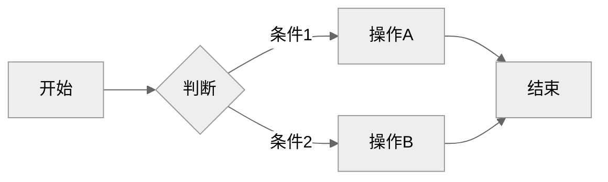
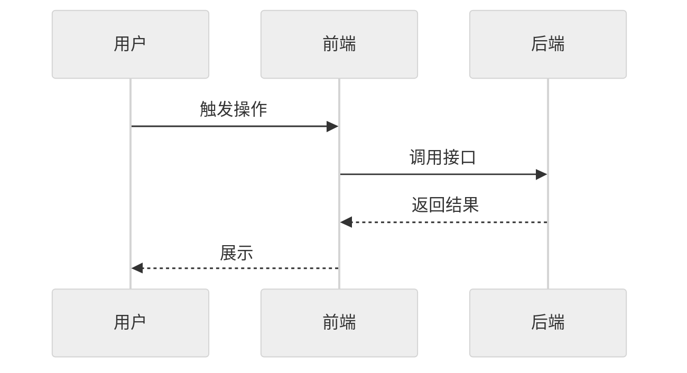
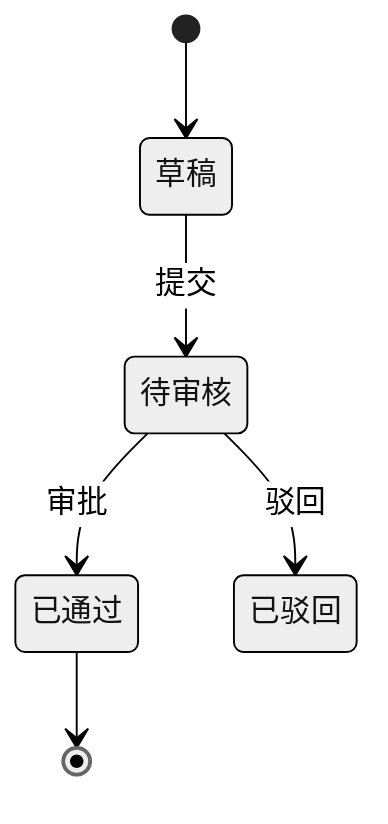

# REQ-009: 测试阶段按改动层级自动选择

## 元信息

| 属性 | 值 |
|-----|-----|
| 编号 | REQ-009 |
| 类型 | 全栈 |
| 状态 | 测试中 |
| 模块 | 插件架构 |
| 优先级 | P2 |
| 创建日期 | 2026-09-23 |
| 负责人 | - |
| branch | feat/REQ-009-test-stage-by-layer |
| issue | - |

## 生命周期

<!-- 需求状态流转：草稿 → 待评审 → 评审通过 → 开发中 → 测试中 → 已完成 -->

- [x] 草稿（编写中）
- [x] 待评审
- [x] 评审通过
- [x] 开发中
- [x] 测试中
- [ ] 已完成

---

## 一、需求描述

### 1.1 背景

`/rd:test` 第 3 步识别变更范围，但只用于定位要跑的测试文件；阶段二（API）、阶段三（E2E）只要 testing.md 配了就照常启动环境、拉起前后端服务——而启动环境通常是测试里最慢、最重的一步。`/rd:dev` 开发完成只给一句固定的 `/rd:test`，不区分改了什么；`/rd:do`、`/rd:fix` 的验证只跑相关 UT 与自主验收，改了接口也不会提示跑 API 测试。

### 1.2 目标

- **功能目标**：按改动所在层级自动选择要跑的测试阶段，并在开发完成时给出带依据的测试建议；「层级 → 阶段」的对应规则只写在一处。
- **效果目标**：只改前端时不启动后端服务、只改后端内部时不启动浏览器；改了后端逻辑一定跑 API，改了接口契约一定连 E2E 一起跑；每个被跳过的阶段在报告里都有原因。

### 1.3 客户场景

> 记录客户提出的原始业务场景和诉求

- **场景1**：「开发完成后是否要根据情况建议跑 e2e 或者 api 测试」（DevFlow 维护者，2026-09-23）
- **场景2**：只改了一个业务逻辑函数，跑 `/rd:test` 却要等后端、前端服务全部起来。
- **场景3**：`/rd:fix` 改了一个接口的返回字段，完成提示里没有任何「跑 API 测试」的提醒。

### 1.4 价值

- 减少无关阶段的环境启动时间与测试等待，缩短 `/rd:test` 回路。
- 降低「改了接口 / 页面却没跑对应测试」的漏测风险。
- 规则集中，test / dev / do / fix 四个命令口径一致。

### 1.5 范围与边界

> 明确本期做什么、不做什么，防止范围蔓延

- **本期包含**：
  - `_verify.md` 新增「测试阶段选择」：层级判定来源、层级 → 阶段对应表、多文件取并集、测试文件本身的归属、显式参数优先级
  - `/rd:test` 第 3 步按规则选阶段，未选中阶段不启动环境、报告写跳过原因；新增 `--all` 强制全跑
  - `/rd:dev` 开发完成提示给出预计阶段与依据
  - `/rd:do`、`/rd:fix` 验证结果段加「建议测试」行
- **本期不做**：
  - `/rd:do`、`/rd:fix` 自动跑 API / E2E（启动环境过重，只给建议）
  - 改变第 7 步自主验收的触发条件
  - 按改动做更细的测试用例级选择（仍由第 3 步定位测试文件完成）
  - 修改 `test-runner` 契约

### 1.6 干系人

> 除了提出方，还有哪些人会因此变化受影响

| 角色 | 关注点 | 备注 |
|------|-------|------|
| 提出方 | 开发完成后知道该跑哪些测试 | DevFlow 维护者 |
| 下游开发者 | `/rd:test` 可能自动跳过以前会跑的阶段；dev / do / fix 提示多一行 | 报告写明跳过原因，`--all` 可强制全跑 |
| 需求验收人 | 测试报告里跳过的阶段是否合理 | 依据写到具体文件 |

---

## 二、功能清单

> 列出所有功能点，开发完成后勾选

- [x] **阶段选择规则（_verify.md）**：层级判定优先读 `architecture.md` 分层表，缺失时按路径 / 扩展名推断；层级 → 阶段对应表；多文件取并集；测试文件本身按所属阶段；输出一行「测试阶段：UT ✓ · API ✓（依据 …）· E2E 跳过（原因）」
- [x] **/rd:test 按层级选阶段**：第 3 步识别变更范围后按规则选阶段；未选中的阶段不启动环境、不派 `test-runner`，报告写跳过原因；显式 `--skip-*` 优先；新增 `--all` 强制全跑；第 7 步自主验收不受影响
- [x] **/rd:dev 完成提示**：`/rd:test` 那行附「预计跑：<阶段>（依据 <文件>）；跳过 <阶段>」
- [x] **/rd:do、/rd:fix 建议测试**：验证结果段加「建议测试：<阶段>（依据 <文件>）| 无」，只建议不自动执行
- [x] **文档同步**：`/rd:test` 选项表加 `--all`；tutorial 若列出 `/rd:test` 选项同步

---

## 三、业务规则

| 类型 | 规则 | 说明 |
|------|-----|------|
| 层级判定 | 优先按下游 `docs/prompt/architecture.md` 的分层表（各层目录 / 职责）判定；缺失时按路径与扩展名推断（controller / handler / router / api / dto → 接口层；pages / views / components / public / static / web / frontend 目录及 `.html` / `.vue` / `.svelte` / `.tsx` / `.jsx` / 模板 / 样式 → 前端；lib / service / biz / domain / model / store / repository / dao 目录 → 后端逻辑；`.md`、配置、CI → 非代码；其余代码 → 无法判定） | 推断口径写进 `_verify.md`，不在各命令重复 |
| 层级 → 阶段 | 仅前端 → E2E（不跑后端 UT / API、不启动后端）；后端逻辑 / 数据访问 → UT + API（跳过 E2E）；接口层（契约变化）→ UT + API + E2E；仅非代码 → 不跑任何阶段 | 多个文件取并集。API 测试贯穿逻辑层，后端逻辑变化必须跑 API；接口契约变化会波及前端，必须连 E2E |
| 测试文件 | 改动本身是测试文件时，跑它所属的阶段 | 例：改了 `tests/e2e/*.spec.ts` → E2E |
| 参数优先级 | 显式 `--skip-*` > `--all` > 自动选择；`--all` 与 `--skip-*` 同时给时按 `--skip-*` 跳过 | `--force` 语义不变 |
| 跳过即不启动 | 未选中的阶段不启动对应环境、不派 `test-runner`；报告写「跳过 <阶段>：<原因>」 | 不得静默跳过 |
| 判定不确定 | 无法判定层级的文件按接口层保守处理（跑 UT + API + E2E），并在依据中注明「无法判定」 | 宁多跑不漏跑 |
| 改动来源 | 取「相对分支基准（branchFrom）的实际 git diff」与需求文档 11.3 文件改动清单的并集；无分支基准时取工作区 diff | 11.3 是计划，实际改动可能偏离 |
| 失败重跑 | `--failed` 模式下，上次存在失败用例的阶段必跑，不因本次改动未涉及而跳过 | 避免失败被跳过掩盖 |
| 自主验收 | 第 7 步是否执行只取决于验证项，不受阶段选择影响 | 前端未起时仍按 testing.md 启动 |
| 仅建议 | `/rd:do`、`/rd:fix` 只输出「建议测试」，不自动启动 API / E2E | 启动环境过重 |

---

## 四、使用场景

### 场景1：只改后端逻辑时跑 /rd:test

- **角色**：下游开发者
- **前置条件**：实际改动只含后端逻辑层文件；testing.md 配了 UT、API、E2E
- **基本流程**：
  1. 执行 `/rd:test REQ-XXX` → 第 3 步输出「测试阶段：UT ✓ · API ✓（依据 order_service.go）· E2E 跳过（未改动前端与接口契约）」
  2. 跑 UT 与 API，启动后端服务，不启动前端 / 浏览器
  3. 报告列出 E2E 跳过原因
- **异常流程**：
  - 用户怀疑判定有误 → `/rd:test REQ-XXX --all` 强制全跑
  - 改动含无法判定层级的文件 → 按 UT + API 保守执行，依据注明「无法判定」

### 场景2：/rd:dev 开发完成的测试建议

- **角色**：下游开发者
- **前置条件**：开发完成，改动含接口层文件
- **基本流程**：
  1. 完成提示显示 `/rd:test REQ-XXX - 进入测试（预计跑：UT + API + E2E，依据 order_controller.go 接口契约变化）`
- **异常流程**：
  - 没有改动清单也无 git diff → 提示按全阶段执行

### 场景3：/rd:fix 改了接口字段

- **角色**：下游开发者
- **前置条件**：修复涉及接口返回字段
- **基本流程**：
  1. 验证结果段出现「建议测试：UT + API + E2E（依据 user_handler.go 接口契约变化）」
  2. 用户按建议自行执行 `/rd:test` 或 API 测试命令
- **异常流程**：
  - 只改了文档 → 「建议测试：无」

---

## 五、数据与交互

> 根据需求类型填写不同内容：
> - **后端 / 全栈**：描述需要的接口能力和业务语义，技术方案在 `/rd:dev` 阶段生成
> - **前端**：描述页面交互逻辑，`/rd:dev` 阶段自动匹配后端接口

### 后端/全栈：接口需求

| 能力 | 输入 | 输出 | 说明 |
|------|------|------|------|
| 阶段选择 | 改动文件（相对 branchFrom 的实际 git diff ∪ 需求文档 11.3）、architecture.md 分层表（可选）、`--skip-*` / `--all` / `--failed` 上次失败清单 | 每个阶段 跑 / 跳过 + 依据文件或跳过原因 | 规则只写在 `_verify.md` |
| 测试建议 | 阶段选择结果 | `/rd:dev` 完成提示行；`/rd:do`、`/rd:fix` 验证结果段「建议测试」行 | 只建议 |

### 前端：交互逻辑

> 按页面/模块描述用户操作和数据流转，不指定具体接口

**页面：XXX**

| 操作/区域 | 用户行为 | 数据需求 | 交互反馈 |
|----------|---------|---------|---------|
| 列表区域 | 进入页面 | 分页数据（字段1、字段2...） | 加载中 → 展示列表 / 空状态 |
| 搜索 | 输入关键词、选择筛选条件 | 按条件过滤列表 | 实时刷新列表 |
| 操作按钮 | 点击审核/删除/导出 | 提交操作结果 | 成功提示 / 失败原因 |

---

## 六、测试要点

### 6.1 技术测试

- [x] `python3 scripts/check-layout.py --check` 与 `python3 scripts/check-requirements.py --check` 通过
- [x] `grep -n "测试阶段选择" plugins/rd/shared/_verify.md plugins/rd/commands/test.md plugins/rd/commands/dev.md` 均命中
- [x] `/rd:test` 选项表含 `--all`；改动文件均 < 30 KB

### 6.2 验收标准

> 产品/业务方验收时的确认项，描述可观测的业务结果

- [x] 验收项1：示例项目只改一个后端逻辑层文件后执行 `/rd:test`，跑 UT + API，报告写「跳过 E2E：未改动前端与接口契约」，未启动前端 / 浏览器
- [x] 验收项2：只改一个前端页面后执行 `/rd:test`，跑 E2E（含 `acceptance/` 探针回归），跳过 UT 与 API 并写明原因，未启动后端服务
- [x] 验收项3：改动含接口层文件时，`/rd:dev` 完成提示给出「预计跑：UT + API + E2E（依据 <文件>）」（规则核对）
- [x] 验收项4：`/rd:test --all` 在同样改动下跑全部已配置阶段；`--skip-e2e --all` 时仍跳过 E2E（规则核对）
- [x] 验收项5：`/rd:fix` 修改接口字段后，验证结果段出现「建议测试：UT + API + E2E（依据 <文件>）」，且未自动启动任何服务（规则核对）
- [x] 验收项6：只改 `.md` 文档时执行 `/rd:test`，报告写明三个阶段均跳过及原因（规则核对）
- [ ] 验收项7：无 `architecture.md` 的项目按路径推断，含无法判定层级的文件时按 UT + API + E2E 执行并注明「无法判定」（待复测：无 architecture.md 时 `.html` / `public/` 被归为后端逻辑，已修；2026-09-27 规则核对通过，运行时 6.3.0 未含修复，发版后实测）
- [x] 验收项8：`/rd:test --failed` 时，上次有失败的阶段即使本次改动未涉及也照常执行（规则核对）
- [x] 验收项9：实际改动含 11.3 未列出的接口层文件时，阶段选择按实际 diff 纳入 API 与 E2E（规则核对）

---

## 七、图示（可选）

> 用 Mermaid 绘制，GitHub/Gitea 原生渲染。主题建议统一用 `neutral`（打印友好、明暗模式兼容）。
> 无图可删除本节，按需保留下方子节。

### 7.1 流程图（业务流程、用户操作路径）

### 7.2 时序图（接口调用链、前后端交互）

### 7.3 ER 图 / 状态图（按需）

---

## 八、评审记录

| 日期 | 评审人 | 结论 | 意见 |
|-----|-------|------|------|
| 2026-09-24 | AI 预审 | 预审未提审 | 阻塞 1：只改逻辑层即跳过 API，会系统性漏掉最能兜住行为回归的测试（API 测试贯穿逻辑层）。建议 3：关联缺 REQ-010 且改同文件需定开发顺序；改动来源应取实际 diff ∪ 11.3；--failed 时上次有失败的阶段必跑。信息 1：monorepo 多服务分层本期不覆盖 |
| 2026-09-24 | AI 预审 | 提审 | 无阻塞项。上轮阻塞（逻辑层跳过 API）与 3 条建议已按预审修改；信息 1：monorepo 多服务分层本期不覆盖 |
| 2026-09-24 | haiqing | 通过 | - |

---

## 九、变更记录

| 日期 | 变更内容 | 影响范围 |
|-----|---------|---------|
| 2026-09-23 | 初始版本（原拟 QUICK-008，命中「下游可感知的行为变化」改走 REQ） | - |
| 2026-09-24 | 按 AI 预审修改：层级 → 阶段改为「仅前端 → E2E；后端逻辑 → UT + API；接口契约 → UT + API + E2E」，无法判定按接口层处理；新增改动来源（实际 diff ∪ 11.3）与 --failed 必跑规则；关联补 REQ-010 与开发顺序；6.2 更新验收项 1/2/3/7，新增 8/9 | 一、三、四、五、六、十章 |
| 2026-09-24 | REQ-010 改为同分支开发、一起合并（原定先合并本需求再切分支） | 十章 |
| 2026-09-25 | 示例项目实测发现：无 architecture.md 时 `.html` / `public/` 被归为后端逻辑、「其余代码 → 后端逻辑」让「无法判定」永不触发；推断规则补前端目录与扩展名、后端只认常见后端目录、其余代码按无法判定 | 三章 |

---

## 十、关联信息

- **关联需求**：REQ-010（同样修改 `fix.md` 与 `_verify.md`，**在本需求分支 `feat/REQ-009-test-stage-by-layer` 上一起开发、一起合并**，PR 标题带两个编号）；REQ-008（第 7 步自主验收，本需求不改其触发条件；E2E 阶段回归含 `acceptance/` 探针）；QUICK-003（`_verify.md` 验证骨架）；REQ-006（`/rd:test` 支持 QUICK 验证方式）
- **相关文档**：`plugins/rd/commands/test.md`、`plugins/rd/shared/_verify.md`、`plugins/rd/commands/dev.md`、`plugins/rd/commands/do.md`、`plugins/rd/commands/fix.md`
- **假设**：下游 `architecture.md` 的分层表能区分接口层与逻辑层；缺失时路径 / 扩展名推断对常见项目结构足够准确
- **外部依赖**：无
- **风险项**：技术风险——层级误判导致该跑的阶段被跳过（如改动表面是逻辑层实则改了接口契约），以「报告写跳过原因 + `--all` 兜底 + 无法判定按保守处理」缓解；行为风险——下游用户习惯了全阶段执行，需在 changelog 写明

---

## 十一、实现方案

> 本章节在 `/rd:dev` 阶段由 AI 分析代码后自动生成，创建需求时无需填写。

### 11.1 数据模型

不涉及。

### 11.2 API 设计

> 基于第五章接口需求，结合项目代码和 CLAUDE.md API 风格，生成具体技术方案

非 HTTP 接口，约定输出格式：

- `/rd:test` 第 3 步：`测试阶段：UT ✓ · API ✓（依据 order_service.go）· E2E 跳过（未改动前端与接口契约）`
- 验证结果段 / `/rd:dev` 完成提示：`建议测试：UT + API（依据 order_service.go）` | `建议测试：无（仅改文档 / 配置）`

### 11.3 文件改动清单

| # | 文件 | 类型 | 改动 |
|---|------|------|------|
| 1 | `plugins/rd/shared/_verify.md` | 修改 | 新增「测试阶段选择」：改动来源（实际 diff ∪ 11.3）、层级判定（architecture.md 分层表优先，缺失按路径 / 扩展名）、层级 → 阶段表、测试文件归属、无法判定按接口层、参数优先级、`--failed` 必跑、输出格式；验证结果段加「建议测试」行；头注说明供 test / dev 共用 |
| 2 | `plugins/rd/commands/test.md` | 修改 | 第 3 步按规则选阶段；阶段一~三未选中即跳过、不启动环境、不派 test-runner；汇总报告写跳过原因；选项表与测试模式表加 `--all` |
| 3 | `plugins/rd/commands/dev.md` | 修改 | 第 11 步完成提示的 `/rd:test` 行附预计阶段与依据 |
| 4 | `plugins/rd/commands/do.md` | 修改 | 验证结果模板加「建议测试」行 |
| 5 | `plugins/rd/commands/fix.md` | 修改 | 同上 |

### 11.4 实现步骤

1. `_verify.md`「测试阶段选择」（唯一规则源）
2. `test.md` 第 3 步、阶段一~三、报告与选项
3. `dev.md`、`do.md`、`fix.md` 各一两行
4. 跑 `check-layout.py --check`、`check-requirements.py --check`，核对 6.1（grep 命中、`--all`、< 30 KB）
5. 合并 → 发版 → `/plugin` 更新后在示例项目按 6.2 实测
