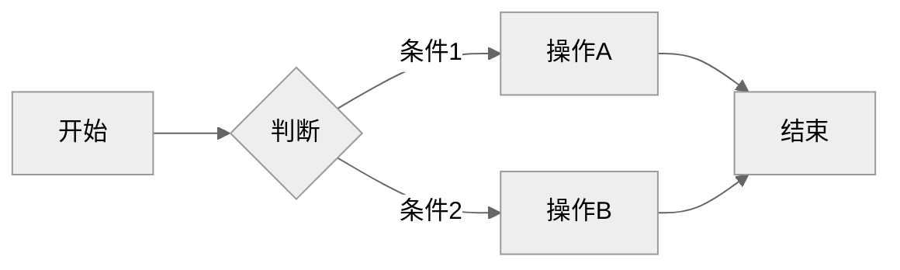
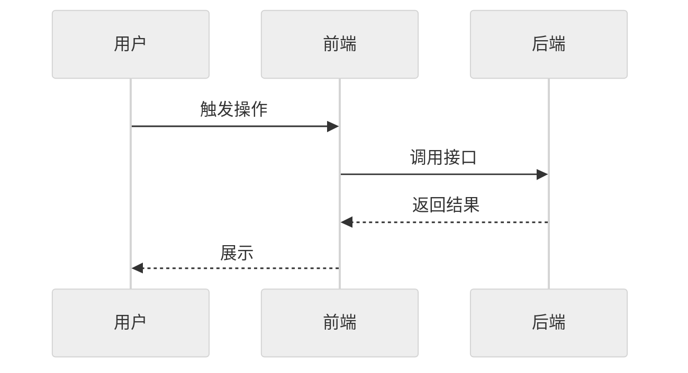
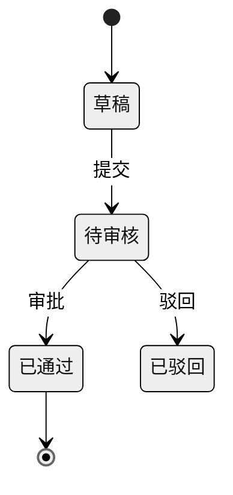

# REQ-010: 探针复现问题与确认现状

## 元信息

| 属性 | 值 |
|-----|-----|
| 编号 | REQ-010 |
| 类型 | 全栈 |
| 状态 | 评审通过 |
| 模块 | 插件架构 |
| 优先级 | P2 |
| 创建日期 | 2026-09-24 |
| 负责人 | - |
| branch | - |
| issue | - |

## 生命周期

<!-- 需求状态流转：草稿 → 待评审 → 评审通过 → 开发中 → 测试中 → 已完成 -->

- [x] 草稿（编写中）
- [x] 待评审
- [x] 评审通过
- [ ] 开发中
- [ ] 测试中
- [ ] 已完成

---

## 一、需求描述

### 1.1 背景

REQ-008 的 `ui-verifier` 只用在「改完之后」验收。改之前同样有不确定：`/rd:fix` 定位 bug 只凭用户描述与读代码，描述不准或问题只在特定环境 / 操作顺序下出现时，容易对着猜测的问题修，修完也拿不出「问题确实存在、现在消失了」的证据；`/rd:new`、`/rd:edit` 讨论「问题与现状」时，页面当前的实际表现靠记忆写，前提错了整个需求就偏了。

### 1.2 目标

- **功能目标**：把 headless 探针用在改之前——`/rd:fix` 先复现再修、修完用同一探针验收；需求讨论中对不确定的现状先探针确认再写入文档。
- **效果目标**：UI 可观察的 bug 修复都有「修前 FAIL → 修后 PASS」的证据并留下回归探针；无法复现时停下与用户确认，不在猜测上修；需求背景里的现状描述可追溯到探针结论。

### 1.3 客户场景

> 记录客户提出的原始业务场景和诉求

- **场景1**：「甚至在需求问题不确定时可以 e2e 去确认问题」（DevFlow 维护者，2026-09-23）
- **场景2**：用户报「订单页统计数字不对」，`/rd:fix` 先跑探针复现出「期望 共 3 条，实际 共 2 条」，再据此定位写死的文案。
- **场景3**：讨论需求时不确定「导出按钮现在能不能点」，派探针看一眼，把结论写进 1.1 背景。

### 1.4 价值

- 修复建立在已复现的事实上，减少误修与返工。
- 修前 FAIL / 修后 PASS 成为修复证据，探针留作回归。
- 需求前提可验证，降低需求方向跑偏的风险。

### 1.5 范围与边界

> 明确本期做什么、不做什么，防止范围蔓延

- **本期包含**：
  - `/rd:fix`：UI 可观察的问题在根因分析前派 `ui-verifier` 复现；复现结果作为根因素材；无法复现时停下确认；修完 `_verify.md` 重跑同一探针
  - `/rd:new`、`/rd:edit`：「问题与现状」讨论中 AI 发现现状不确定时提议探针确认，用户同意后派发，结论写入 1.1 背景并注明依据
  - `_verify.md`：「自主验收」补复现 / 确认现状两种用法的结果解读与探针命名
- **本期不做**：
  - 修改 `ui-verifier` 契约与自主验收前置三条
  - 接口层问题的复现（主会话直接调接口即可，现有能力）
  - `/rd:do` 接入（优化 / 重构目标是行为不变，靠修后验收即可）
  - 生产环境复现（探针只对 testing.md 的测试前端）

### 1.6 干系人

> 除了提出方，还有哪些人会因此变化受影响

| 角色 | 关注点 | 备注 |
|------|-------|------|
| 提出方 | 不确定时先用探针确认 | DevFlow 维护者 |
| 下游开发者 | `/rd:fix` 多一步复现（约 30–60 秒、$0.15–0.2）；无法复现时被拦下确认 | 前置不满足时跳过并说明 |
| 需求编写人 | 讨论中可能被提议跑探针确认现状 | 需用户同意才派 |

---

## 二、功能清单

> 列出所有功能点，开发完成后勾选

- [ ] **/rd:fix 修前复现**：UI 可观察的问题在根因分析前派 `ui-verifier`，探针断言「期望的正确行为」；FAIL = 已复现，期望 vs 实际并入根因素材；PASS = 无法复现，停下与用户确认环境 / 步骤；BLOCKED 或前置不满足 → 跳过并说明原因
- [ ] **/rd:fix 修后验收**：修复后按 `_verify.md` 重跑同一复现探针，FAIL → PASS 记入验证结果段；探针保留为回归
- [ ] **/rd:fix --auto**：复现照常执行；无法复现时停止自动串联，交用户确认
- [ ] **需求讨论确认现状**：提议逻辑写在 `requirement-analyzer` 技能阶段一「问题与现状」主题（`/rd:new` 的讨论由它执行），`new.md`、`edit.md` 各加一句引用；AI 发现现状描述不确定则提议探针确认，用户同意才派；探针断言用户描述的现状，结论写入 1.1 背景并注明「探针确认：<路径>」
- [ ] **_verify.md 用法说明**：复现 / 确认现状的结果解读、探针命名（`acceptance/<分支 slug>/repro-*.spec.ts`、`acceptance/<REQ 编号>/state-*.spec.ts`）

---

## 三、业务规则

| 类型 | 规则 | 说明 |
|------|-----|------|
| 适用范围 | 只对 UI 可观察的问题 / 现状派探针；接口层问题由主会话直接调用确认 | 前置三条同 REQ-008，不满足则跳过并说明 |
| 复现断言 | 复现探针断言「期望的正确行为」：FAIL = 问题存在，PASS = 无法复现 | 修后同一探针 PASS 即修复验收 |
| 无法复现 | PASS 时不进入根因分析，停下向用户确认环境、数据、操作步骤；用户补充后可重派一次；重派仍 PASS → 由用户选择「不带复现继续修（分析输出标注「未复现」，修后无 FAIL → PASS 证据）」或「停止」 | 不在猜测上修；`--auto` 同样停下 |
| 确认现状断言 | 确认探针断言「用户描述的现状」：PASS = 描述属实，FAIL = 与描述不符，把实际表现反馈给用户修正 | 结论写 1.1 背景并注明探针路径 |
| 触发 | `/rd:fix`：前置满足即自动复现；`/rd:new` / `/rd:edit`：AI 提议、用户同意才派 | 需求讨论是多轮交互，不自动花钱 |
| 成本 | 每个探针新增内容 ≤ 3 万 token、≤ $0.25（同 REQ-008）；一个问题只派一个复现 agent，同页现状确认 ≤3 条合并 | 不为每句描述都派 |
| 写回 | 复现 / 确认结论只写进 fix 的分析输出或需求文档 1.1 背景，不勾选任何验证项 | 验证项勾选仍按 REQ-008 自主验收规则 |

---

## 四、使用场景

### 场景1：/rd:fix 先复现再修

- **角色**：下游开发者
- **前置条件**：问题 UI 可观察；自主验收前置三条满足
- **基本流程**：
  1. `/rd:fix 订单页统计数字不对` → 问题分析后派 `ui-verifier` 写复现探针（断言「共 3 条」）
  2. 探针 FAIL（实际「共 2 条」）→ 期望 vs 实际并入根因分析 → 出修复方案
  3. 修复后按 `_verify.md` 重跑同一探针 → PASS → 验证结果段记「复现探针：FAIL → PASS」
- **异常流程**：
  - 探针 PASS（无法复现）→ 停下询问用户环境 / 数据 / 步骤，补充后可重派一次
  - 前置不满足 → 跳过复现，分析输出注明「未复现：<原因>」，按原流程继续

### 场景2：需求讨论中确认现状

- **角色**：需求编写人
- **前置条件**：`/rd:new` 或 `/rd:edit` 讨论「问题与现状」；前置三条满足
- **基本流程**：
  1. 用户说「导出按钮现在好像不能点」→ AI 提议「要不要跑个探针确认？」→ 用户同意
  2. 派 `ui-verifier` 断言「导出按钮为禁用」→ PASS → 1.1 背景写「导出按钮当前为禁用（探针确认：<路径>）」
- **异常流程**：
  - FAIL（实际可点）→ 把实际表现告诉用户，修正现状描述
  - 用户不同意 → 按原流程继续，不派探针

---

## 五、数据与交互

> 根据需求类型填写不同内容：
> - **后端 / 全栈**：描述需要的接口能力和业务语义，技术方案在 `/rd:dev` 阶段生成
> - **前端**：描述页面交互逻辑，`/rd:dev` 阶段自动匹配后端接口

### 后端/全栈：接口需求

| 能力 | 输入 | 输出 | 说明 |
|------|------|------|------|
| 复现问题（/rd:fix → ui-verifier） | 问题描述转成的验证项（入口 / 操作 / 期望的正确行为）+ REQ-008 约定的其余输入 | PASS / FAIL / BLOCKED + 证据 + 探针路径 | 结果解读与自主验收相反：FAIL = 已复现 |
| 确认现状（/rd:new、/rd:edit → ui-verifier） | 用户描述的现状转成的验证项 | 同上 | PASS = 描述属实 |

### 前端：交互逻辑

> 按页面/模块描述用户操作和数据流转，不指定具体接口

**页面：XXX**

| 操作/区域 | 用户行为 | 数据需求 | 交互反馈 |
|----------|---------|---------|---------|
| 列表区域 | 进入页面 | 分页数据（字段1、字段2...） | 加载中 → 展示列表 / 空状态 |
| 搜索 | 输入关键词、选择筛选条件 | 按条件过滤列表 | 实时刷新列表 |
| 操作按钮 | 点击审核/删除/导出 | 提交操作结果 | 成功提示 / 失败原因 |

---

## 六、测试要点

### 6.1 技术测试

- [ ] `python3 scripts/check-layout.py --check` 与 `python3 scripts/check-requirements.py --check` 通过
- [ ] `grep -n "复现" plugins/rd/commands/fix.md plugins/rd/shared/_verify.md` 与 `grep -n "确认现状" plugins/rd/commands/new.md plugins/rd/commands/edit.md` 均命中
- [ ] `ui-verifier.md` 无改动（契约不变）

### 6.2 验收标准

> 产品/业务方验收时的确认项，描述可观测的业务结果

- [ ] 验收项1：示例项目中 `/rd:fix 订单页统计数字不对`，根因分析前派出复现探针并 FAIL，根因分析引用「期望 共 3 条 / 实际 共 2 条」
- [ ] 验收项2：修复后同一探针 PASS，验证结果段记「复现探针：FAIL → PASS」，探针文件保留在 `acceptance/` 下
- [ ] 验收项3：对一个实际不存在的问题执行 `/rd:fix`，探针 PASS 后停下询问用户，不进入根因分析与修改；用户补充后重派仍 PASS 时，给出「不带复现继续修 / 停止」两个选项
- [ ] 验收项4：`/rd:fix --auto` 下无法复现时停止自动串联 commit / PR
- [ ] 验收项5：`/rd:new` 讨论中对不确定的现状，AI 提议探针确认；用户同意后结论写入 1.1 背景并附探针路径；用户拒绝则不派
- [ ] 验收项6：前置不满足（如 testing.md 缺前端地址）时 `/rd:fix` 跳过复现并注明原因，流程照常继续

---

## 七、图示（可选）

> 用 Mermaid 绘制，GitHub/Gitea 原生渲染。主题建议统一用 `neutral`（打印友好、明暗模式兼容）。
> 无图可删除本节，按需保留下方子节。

### 7.1 流程图（业务流程、用户操作路径）

### 7.2 时序图（接口调用链、前后端交互）

### 7.3 ER 图 / 状态图（按需）

---

## 八、评审记录

| 日期 | 评审人 | 结论 | 意见 |
|-----|-------|------|------|
| 2026-09-24 | AI 预审 | 提审 | 无阻塞项。建议 3：十章「与 REQ-009 可并行开发」与同分支开发不符，需改并同步 REQ-009；确认现状的提议逻辑应落在 requirement-analyzer 技能阶段一，功能清单写明；无法复现重派后仍 PASS 的处理未定义 |
| 2026-09-24 | haiqing | 通过 | - |

---

## 九、变更记录

| 日期 | 变更内容 | 影响范围 |
|-----|---------|---------|
| 2026-09-24 | 初始版本（触发方式按推荐：fix 前置满足即自动复现；new / edit AI 提议、用户同意才派） | - |
| 2026-09-24 | 按 AI 预审建议修改：确认现状的提议逻辑落在 requirement-analyzer 技能阶段一；补「重派仍无法复现」由用户选择继续或停止；改为与 REQ-009 同分支开发、一起合并 | 二、三、十章 |

---

## 十、关联信息

- **关联需求**：REQ-008（复用 `ui-verifier` 与自主验收前置三条，契约不变）；REQ-009（阶段选择；两者都改 `fix.md`、`_verify.md`，**在同一分支 `feat/REQ-009-test-stage-by-layer` 上开发、一起合并**，PR 标题带两个编号）
- **相关文档**：`plugins/rd/commands/fix.md`、`plugins/rd/skills/requirement-analyzer/SKILL.md`、`plugins/rd/commands/new.md`、`plugins/rd/commands/edit.md`、`plugins/rd/shared/_verify.md`
- **假设**：用户的问题描述能转成「入口 + 操作 + 期望」的验证项；描述缺关键信息时 AI 先追问再派
- **外部依赖**：REQ-008 已发布（rd 6.2.x）
- **风险项**：技术风险——探针写错导致「假无法复现」，以「PASS 不等于没问题、停下问用户」兜底；成本风险——`/rd:fix` 每次多约 $0.15–0.2 与 30–60 秒，仅 UI 可观察问题触发

---

## 十一、实现方案

> 本章节在 `/rd:dev` 阶段由 AI 分析代码后自动生成，创建需求时无需填写。

### 11.1 数据模型

_开发阶段填充_

### 11.2 API 设计

> 基于第五章接口需求，结合项目代码和 CLAUDE.md API 风格，生成具体技术方案

_开发阶段填充_

### 11.3 文件改动清单

_开发阶段填充_

### 11.4 实现步骤

_开发阶段填充_
