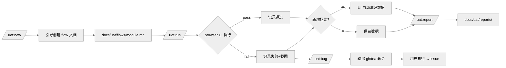

# REQ-002: uat 插件 - 用户验收测试（UAT）工作流

## 元信息

| 属性 | 值 |
|-----|-----|
| 编号 | REQ-002 |
| 类型 | 全栈 |
| 状态 | 已完成 |
| 模块 | uat |
| 优先级 | P2 |
| 创建日期 | 2026-05-11 |
| 完成日期 | 2026-05-12 |
| 负责人 | - |
| branch | feat/REQ-002-qa-uat-e2e-workflow |
| issue | - |

## 生命周期

- [x] 草稿（编写中）
- [x] 待评审
- [x] 评审通过
- [x] 开发中
- [x] 测试中
- [x] 已完成

---

## 一、需求描述

### 1.1 背景

devflow 现有 `browser:browser` 技能提供了底层浏览器操控能力，但缺乏规划层和流程规范：没有结构化的测试场景文档，每次验收都依赖临时口述，结果无法沉淀。

团队需要一个以"测试流程文档"为核心的 UAT 工作流——文档人工维护、AI 按文档执行、结果可追溯、问题可直接上报 bug。

### 1.2 目标

- **功能目标**：提供 `uat` 插件，包含测试文档引导创建、AI 执行测试、报告生成、bug 上报完整闭环
- **效果目标**：测试流程文档越迭代越完善，UAT 验收效率提升，减少口口相传的测试用例遗漏

### 1.3 客户场景

- **场景1**：前端功能上线前，开发者希望快速验收主流程，无需手写 Playwright 脚本，直接告诉 Claude 要测什么，AI 自动操控浏览器并报告结果
- **场景2**：QA 维护一份登录/下单等核心流程文档，每次迭代后执行 `/uat:run` 做回归验收，失败项自动提到 issue
- **场景3**：新成员加入，通过阅读 `docs/uat/flows/` 快速了解系统核心操作路径

### 1.4 价值

- 测试知识文档化：测试场景沉淀为可版本管理的 Markdown 文档
- 降低自动化门槛：不需要写代码，AI 作为指挥家协调工具完成执行
- 闭环：测试 → 报告 → bug 上报，无需人工搬运

### 1.5 范围与边界

- **本期包含**：
  - `uat` 插件骨架（commands/ + skills/）
  - 测试流程文档格式规范及 `/uat:new` 引导创建
  - `/uat:run` 执行测试（Claude 作为指挥家，调用 browser 技能等底层工具）
  - `/uat:report` 生成 Markdown 测试报告
  - `/uat:bug` 询问用户是否上报，按项目配置创建 issue
  - `uat-executor` skill：指导 Claude 按场景执行测试的核心逻辑
  - 表单边界 & 字符类型测试矩阵（B1-B3 边界 + C1-C7 字符类型）
  - 浮层组件操作规范（Select / Cascader / DatePicker）
  - 新增场景自动清理测试数据（仅 UI 删除）
  - data-testid 命名约定文档（`/uat:init` 自动生成）
  - 执行阶段纯 UI（所有操作通过界面，不调用 API）
- **本期不做**：
  - 测试结果的历史趋势统计
  - 与 CI/CD 流水线集成
  - desktop app 等非浏览器执行引擎的专用适配
  - 截图自动附件上传到 issue（文字描述 + 截图路径即可）

### 1.6 干系人

| 角色 | 关注点 | 备注 |
|------|-------|------|
| 开发者 | 上线前快速 UAT 验收 | 主要使用者 |
| QA | 回归测试、bug 上报 | 维护测试文档 |
| 前端开发 | 添加 data-testid 属性 | 参考 testid-convention.md |
| 新成员 | 了解系统操作路径 | 只读 flows 文档 |

---

## 二、功能清单

- [x] **uat 插件骨架**：创建 `plugins/uat/` 目录结构（commands/ skills/）并注册到 marketplace.json
- [x] **`/uat` 入口命令**：列出 `docs/uat/flows/` 下所有模块及上次执行状态
- [x] **`/uat:new` 引导创建**：多轮对话收集测试场景，生成结构化 flow 文档
  - 引导填写全局测试数据、已知结论、选择器、等待信号
  - 检测表单场景，自动引导补充边界测试
  - 支持下拉/级联选择的分离写法（触发器 + 浮层）
- [x] **`/uat:run [module]`**：读取 flow 文档，逐场景执行，记录 pass/fail
  - 已知结论场景自动 SKIP
  - 新增场景执行完后自动 UI 清理测试数据
  - 仅失败时截图
  - 有 FAIL 时打印工单上报命令
- [x] **`/uat:report`**：从最近一次运行结果生成 `docs/uat/reports/YYYY-MM-DD-<module>.md`
- [x] **`/uat:bug`**：展示失败场景，输出 `gh` / `tea` issue 创建命令
- [x] **`uat-executor` skill**：
  - 选择器优先级（data-testid > aria-label > CSS）
  - 等待信号策略（替代固定 sleep）
  - 浮层组件操作规则（全局查找、分层等待、重试）
  - 表单边界 & 字符类型测试执行策略
  - 测试数据清理规则（新增清理、编辑保留）
- [x] **`/uat:init`**：初始化目录结构 + 安装 skill + 生成 testid-convention.md
- [x] **testid-convention.md 模板**：data-testid 命名约定（`<功能域>-<元素类型>`）

---

## 三、业务规则

| 类型 | 规则 | 说明 |
|------|-----|------|
| 运行环境 | 必须在 Codex Chrome 或 Claude 桌面客户端中使用 | 普通终端无浏览器工具，需提示用户 |
| 纯 UI 执行 | 执行阶段所有操作通过界面，不调用 API | API 信息仅在 `/uat:new` 撰写文档时作参考 |
| 平台无关 | Claude 只负责"指挥"，不直接实现浏览器操作 | 底层工具（browser skill 等）负责执行 |
| 浮层查找 | 触发器在容器内找，浮层选项在 body 全局找 | ant-design / element-plus 浮层渲染到 body |
| 截图策略 | 仅在步骤失败时截图 | 通过步骤不截图，减少产物体积 |
| 数据清理 | 新增场景测试完成后自动 UI 删除测试数据 | 编辑场景不清理（数据是已有的） |
| bug 上报 | FAIL 时打印上报命令，由用户决定是否执行 | 支持 GitHub（gh）/ Gitea（tea）两种 CLI |
| 结果存储 | 报告写入 `docs/uat/reports/`，纳入 git | 不自动 push |
| 文档约定 | flow 文档单文件建议 < 30 场景 | 过多时建议按功能域拆分 |

---

## 四、使用场景

### 场景1：首次为某功能创建测试文档

- **角色**：开发者 / QA
- **前置条件**：已进入 Codex Chrome 或 Claude 桌面端
- **基本流程**：
  1. 执行 `/uat:new` → AI 询问功能名称、入口 URL
  2. AI 多轮对话收集测试场景（步骤 + 预期结果 + 选择器 + 等待信号）
  3. 检测到表单场景，自动询问是否补充边界测试
  4. 用户确认后生成 `docs/uat/flows/<module>.md`
- **异常流程**：
  - 用户描述场景不清晰 → AI 追问直到明确

### 场景2：执行回归测试

- **角色**：开发者 / QA
- **前置条件**：`docs/uat/flows/` 下有已创建的 flow 文档
- **基本流程**：
  1. 执行 `/uat:run` 或 `/uat:run <module>`
  2. AI 读取 flow 文档，逐场景按选择器和等待信号执行
  3. 已知结论场景自动 SKIP；新增场景执行完自动清理
  4. 每步记录 pass/fail，执行完毕输出汇总
  5. 有失败项时打印工单上报命令
- **异常流程**：
  - 浮层未命中 → 300ms 后重试，最多 2 次，超过标记 FAIL 并截图

### 场景3：上报失败 bug

- **角色**：QA
- **前置条件**：最近一次 `/uat:run` 有失败场景
- **基本流程**：
  1. 执行 `/uat:bug`
  2. AI 列出所有失败场景，给出 `gh issue create` / `tea issue create` 命令
  3. 用户执行命令，手动附上截图附件
- **异常流程**：
  - 未配置 CLI → 打印手动创建 issue 的字段内容

---

## 五、数据与交互

| 能力 | 输入 | 输出 | 说明 |
|------|------|------|------|
| 创建 flow 文档 | 模块名、场景列表、选择器、等待信号 | Markdown 文件 | 写入 `docs/uat/flows/` |
| 执行测试场景 | flow 文档路径 | pass/fail 列表 + 截图路径（失败时） | 调用 browser 技能 |
| 生成报告 | 最近执行结果 | Markdown 报告文件 | 写入 `docs/uat/reports/` |
| 创建 issue | 失败场景描述 | `gh` / `tea` 命令字符串 | 用户执行 CLI 命令 |

---

## 六、测试要点

### 6.1 技术测试

- [x] `/uat:new` 引导流程能正确生成符合格式的 flow 文档（含测试数据、已知结论、选择器字段）
- [x] `/uat:run` 能逐场景执行并正确记录 pass/fail
- [x] 新增场景执行后自动 UI 清理；编辑场景不清理
- [x] 浮层组件操作：触发器 → 等浮层出现 → 点选项 → 等浮层消失
- [x] 表单边界测试矩阵逐行执行，失败时截图
- [x] `/uat:report` 生成报告包含全部场景及结果
- [x] `/uat:bug` 输出可执行的 gh / tea 命令
- [x] 在非 Codex Chrome / Claude 桌面端运行时，给出环境不满足的提示

### 6.2 验收标准

- [x] 执行 `/uat:new` 后，`docs/uat/flows/` 下能看到新建的测试文档，格式符合规范
- [x] 执行 `/uat:run` 后，能在终端看到逐场景的 pass/fail 汇总
- [x] 执行 `/uat:report` 后，`docs/uat/reports/` 下生成带日期的报告文件
- [x] 失败时有截图路径，PASS 时无截图

---

## 七、图示

### 7.1 流程图



---

## 八、评审记录

| 日期 | 评审人 | 结论 | 意见 |
|-----|-------|------|------|
| 2026-05-12 | haiqing | ✅ 通过 | - |

---

## 九、变更记录

| 日期 | 变更内容 | 影响范围 |
|-----|---------|---------|
| 2026-05-11 | 初始版本（qa 插件骨架） | - |
| 2026-05-12 | 提升可执行性：选择器字段、等待信号、已知结论、全局测试数据、数据准备字段 | flow-template, uat-executor |
| 2026-05-12 | 表单边界 & 字符类型测试矩阵（B1-B3 + C1-C7）；仅失败截图；FAIL 后提示上报工单 | flow-template, uat-executor |
| 2026-05-12 | 浮层组件操作规范：触发器/浮层分离写法、分层等待、重试规则 | flow-template, uat-executor, new.md |
| 2026-05-12 | 新增场景自动清理（UI 删除）；编辑场景不清理 | uat-executor, flow-template, new.md |
| 2026-05-12 | 执行阶段纯 UI：删除 api-then-verify 模式和 API DELETE 清理 | uat-executor, flow-template, new.md |
| 2026-05-12 | 插件重命名：qa → uat；路径 docs/qa/ → docs/uat/；命令 /qa:xxx → /uat:xxx | 全部文件，marketplace.json |

---

## 十、关联信息

- **关联需求**：-
- **相关文档**：`docs/uat/testid-convention.md`（data-testid 命名约定）
- **假设**：用户在 Codex Chrome 或 Claude 桌面客户端中运行，browser 技能可用
- **外部依赖**：`browser:browser` 技能（底层浏览器操控）；`gh` / `tea` CLI（可选，bug 上报）
- **风险项**：browser 技能能力边界不确定，复杂交互场景可能需要多次重试；浮层选择器因框架版本不同可能需调整

---

## 十一、实现方案

### 11.1 数据模型

无数据库。核心存储文件：

| 文件 | 说明 |
|------|------|
| `docs/uat/flows/<module>.md` | 测试流程文档，人工维护 |
| `docs/uat/reports/YYYY-MM-DD-<module>.md` | 测试报告，`/uat:run` 自动生成 |
| `docs/uat/screenshots/` | 失败截图，`/uat:run` 失败时自动生成 |
| `docs/uat/testid-convention.md` | data-testid 命名约定，`/uat:init` 生成 |

**flow 文档格式规范**（由模板约束）：
- 元信息区：模块名、操作方式（browser/desktop）、入口 URL、创建日期、最后执行日期
- 测试数据区：全局复用的账号/密码/字段值
- 已知结论区：标记跳过的路径
- 场景区：每个场景含 ID（S01/S02...）、前置条件、数据准备（可选）、数据清理（新增场景必填）、步骤列表（含选择器 + 等待信号）、预期结果

### 11.2 命令列表

| 命令 | 参数 | 输出 |
|------|------|------|
| `/uat` | - | 列出 flows/ 下所有模块 + 上次执行状态 |
| `/uat:init` | - | 创建目录结构 + 安装 uat-executor skill + 生成 testid-convention.md |
| `/uat:new [module]` | 模块名（可选） | 生成 `docs/uat/flows/<module>.md` |
| `/uat:run [module]` | 模块名（省略则列出可选） | 逐场景 pass/fail 汇总 + 写报告文件 |
| `/uat:report [module]` | 模块名（可选） | 格式化最近报告并展示 |
| `/uat:bug [module]` | 模块名（可选） | 读最近报告失败项 → 输出 issue 创建命令 |

### 11.3 文件结构

```
plugins/uat/
├── .claude-plugin/
│   └── plugin.json            # 插件元数据（version: 1.0.0）
├── commands/
│   ├── uat.md                 # 入口：列出模块 + 状态
│   ├── init.md                # 初始化：创建目录 + 安装 skill
│   ├── new.md                 # 引导创建测试流程文档
│   ├── run.md                 # 执行测试场景
│   ├── report.md              # 生成/展示测试报告
│   └── bug.md                 # 失败项上报 issue
├── skills/
│   └── uat-executor/
│       └── SKILL.md           # 核心执行引导 skill
└── templates/
    ├── flow-template.md       # flow 文档模板
    └── testid-convention.md   # data-testid 命名约定模板
```

**marketplace 变更**：

```
.claude-plugin/marketplace.json
  metadata.version: 2.32.0
  插件条目: qa → uat，source: ./plugins/uat/
```
